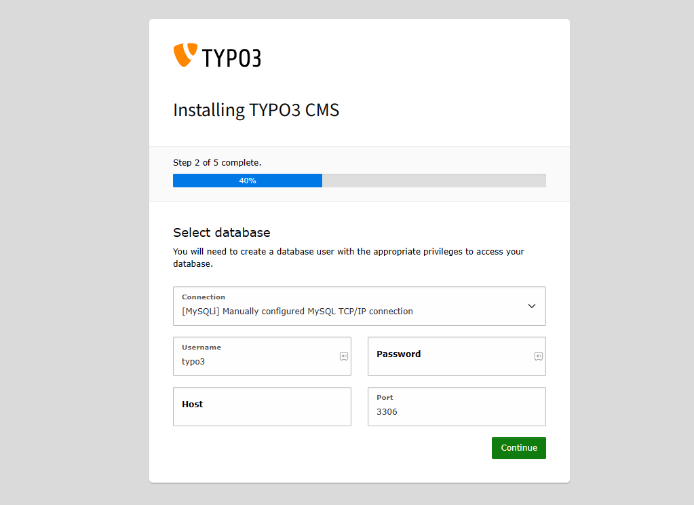
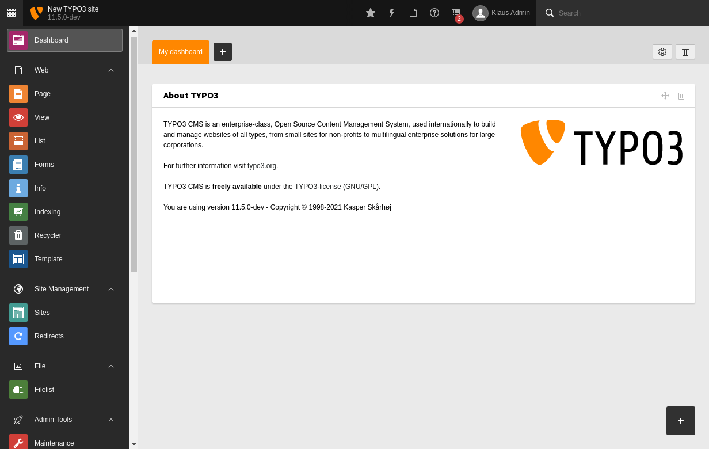

import Meta from './\_include/typo3.md';

<Meta name="meta" />

## Getting Started {#guide}

### Initial Setup {#wizard}

1. After completing the installation of TYPO3 via the **Websoft9 Console**, retrieve the application's **Overview** and **Access** information from the **My Apps** section.

   - **Access Information**: Found in the **Access** section.
   - **Database Account**: Found in the **Database** section.

2. Enter the TYPO3 installation wizard. Once the environment check passes, fill in the database parameters:

   - **Username**: `typo3`
   - **Password**: Retrieve it from the application administration.
   - **Host**: Retrieve it from the application administration.

   

3. Log in to the backend and start creating your website.

   

4. After completing the installation, log in to the backend and begin setting up your site.

## Configuration Options {#configs}

- **CLI**:

  - `typo3` – Official core command line.
  - `typo3cms` – Third-party extension command.

- **Multilingual (✅)**: [Change the Backend Language](https://docs.typo3.org/m/typo3/tutorial-getting-started/main/en-us/Setup/BackendLanguages.html#backendlanguages)

- **Extensions (✅)**: Manage extensions via TYPO3 backend: **ADMIN TOOLS > Extensions**.
- **Template (✅)**: Access templates via TYPO3 backend: **WEB > Template**.

## Administration {#administrator}

- **Online Upgrade (✅)**: Perform upgrades via TYPO3 backend: **ADMIN TOOLS > Upgrade**.

## Troubleshooting {#troubleshooting}
