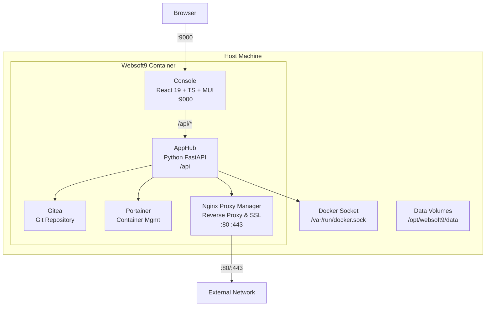

# Architecture

Websoft9 is an application-centric microservices architecture.  

## Architecture philosophy

**Everything is an application, everything can be assembled"** is the basic philosophy of Websoft9, based on this philosophy, we flexibly integrate excellent open source software into our product system.  

- Product Innovation through Assembly
- [The Twelve-Factor App](https://12factor.net/zh_cn/)
- Open source iteration, continuous development
- Focus on connectivity and reduce non-essential original components
- Leverage elements of technology that are already popular and avoid creating new specifications
- GitOps Cloud-native continuous delivery model
- Unix philosophy KISS principle: Keep It Simple, Stupid!
- [Infrastructure as Code (IaC)](https://www.redhat.com/en/topics/automation/what-is-infrastructure-as-code-iac)

## Architecture diagram

Websoft9 uses a **single-container integrated control plane** architecture. All core services run inside one Docker container.

### Core Components

- **Console**: Web management UI built with React 19 + TypeScript + Vite + MUI, served at port `9000`
- **AppHub**: Business logic API built with Python FastAPI, handles app management, auth, proxy, backup, and settings
- **Gitea**: Embedded Git repository service for hosting application templates and code
- **Portainer**: Embedded container management service for Docker container and stack lifecycle
- **Nginx Proxy Manager**: Reverse proxy handling domain binding and Let's Encrypt SSL certificates, bound to ports `80` and `443`

## Open Souce

Websoft9 uses [Docker Compose](https://docs.docker.com/compose/) as a template for applications, and maintained an open source repository [docker-library](https://github.com/Websoft9/docker-) with 200+ templates.   

Applications running on Docker Compose can exist independently of Websoft9, which means maintenance and learning costs are extremely low.  