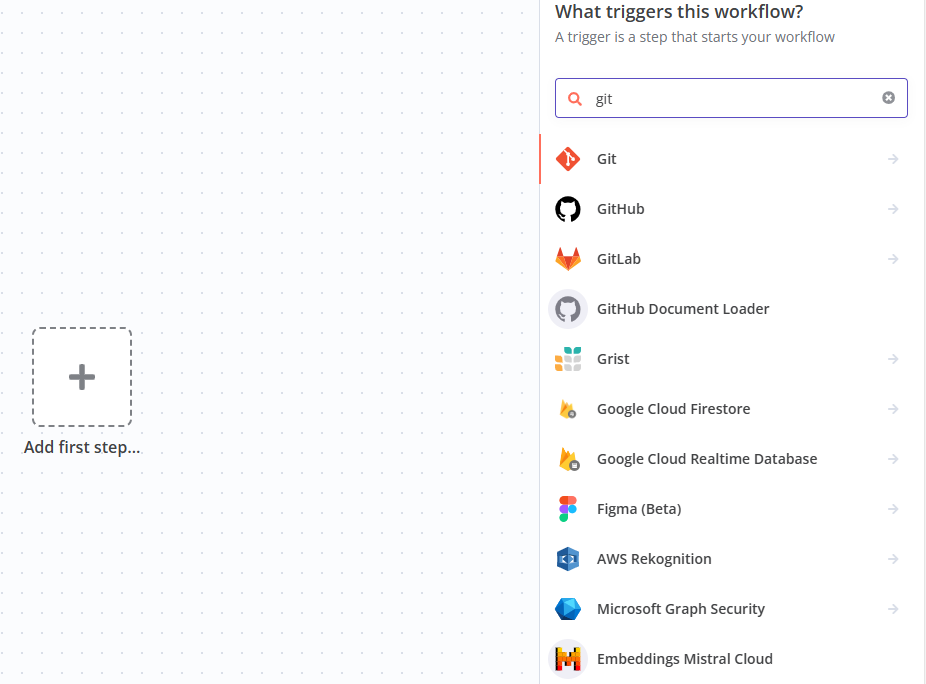

# Auto DevOps

Auto DevOps is a collection of pre-configured features and integrations that work together to support your software delivery process. Auto DevOps detects your programming language and uses CI/CD templates to create and run default pipelines to build and test your application. Then, you can configure deployments to deploy your apps to staging and production, and set up review apps to preview your changes per branch.

## Prepare

- Prepare your Git repository from Github or GitLab or other git platform
- Logint to **n8n** console, click **Credentials** of left memu to add your git credential

## Create git Workflow{#git}

1. Logint to **n8n** console, click **Start from scratch** to create your workflow

2. Select one git source for your trigger flow
   

3. Complete next steps

## Samples

Below samples from n8n for you:  

- [Save resources](https://n8n.io/engineering-resources/)
- [Low-code workflow automation for SecOps](https://n8n.io/secops/)