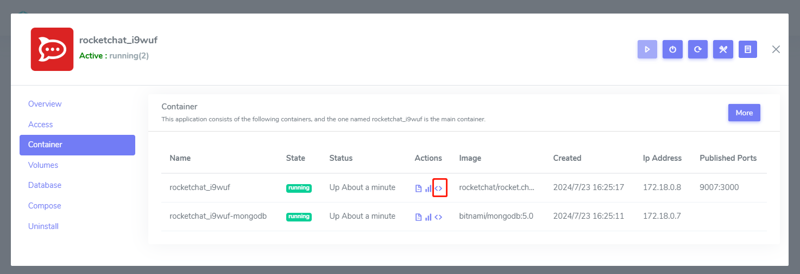
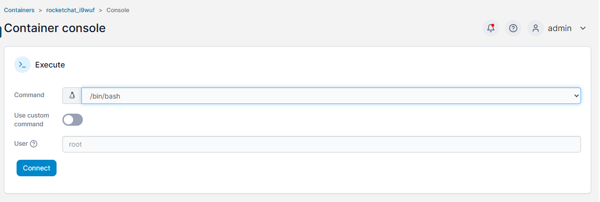

# Run commands in the container

When managing Docker containers, you may need to connect to a running container. It is very helpful if you want to see what is happening inside the container. You can use the  [docker exec](https://docs.docker.com/reference/cli/docker/container/exec/) command, SSH into a running Docker container, or get a shell to the container. 

## Concepts

Before running commands inside a container, let's list a few related concepts:

- Running commands in containers is similar to host machine.
- Commands in containers alter the container's filesystem.
- You can change the user account within containers.
- Filesystem changes in containers require permission considerations.
- Software installed in non-persistent directories will be lost after redeploy.

## Method of access to containers{#docker-exec}

Two methods for you to access container:  

### Access by docker exec commands{#fromserver}

The `docker exec` command runs a new command in a running container at your host machine.  

```
# sample1
docker exec -it container_name bash

# sample2
docker exec -it container_name sh

# sample2
docker exec -it container_name ash

# sample4
docker run --name mycontainer -d -i -t alpine /bin/sh
```

You should know or try to get the shell environment of your container, it may `bash`, `sh`, or `ash`

### Access container by Websoft9 Console{#fromweb}

You can access container by Websoft9 Console which is the implementation of **docker exec** command.  

1. Login to Websoft9 Console, go to application mangement from **My Apps**

2. Open the **Containers** tab, click `<>` icon of Actions column
    

3. It will jump to the **Container console** and you can select the items and **Connect** container
   

4. Once connection success, you can run shell command from terminal
   


## Commans samples

### Install packages in the container

Install packages in the container is the same with host machine:

- Install by Linux repo tools: `apt`, `yum`, `dnf`, `pacman`, `zypper`, `apk`
- Download and compile
- Install by languages repo tools: `pip`, `npm`, `yarn`, `gem`

### Check system settings in the container

- Process and services: `top`, `ps aux`
- Get users: `cat /etc/passwd`
- Network: `netstat -tulnp`, `ss -tuln`

## Troubleshoot

### Container permission issues?

- If the dockerfile does not create non-root user, the container will run as root by default.   
- Container root equals host root, needs `--privileged=true` for same privileges.
- You can switch users within the container using `su`.