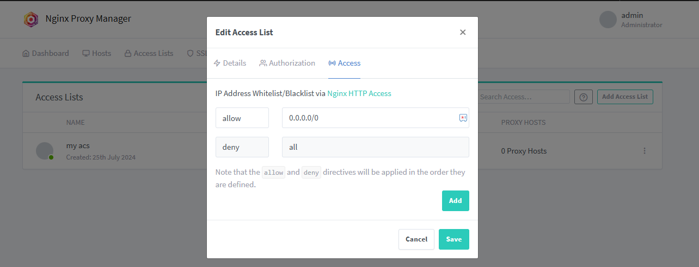
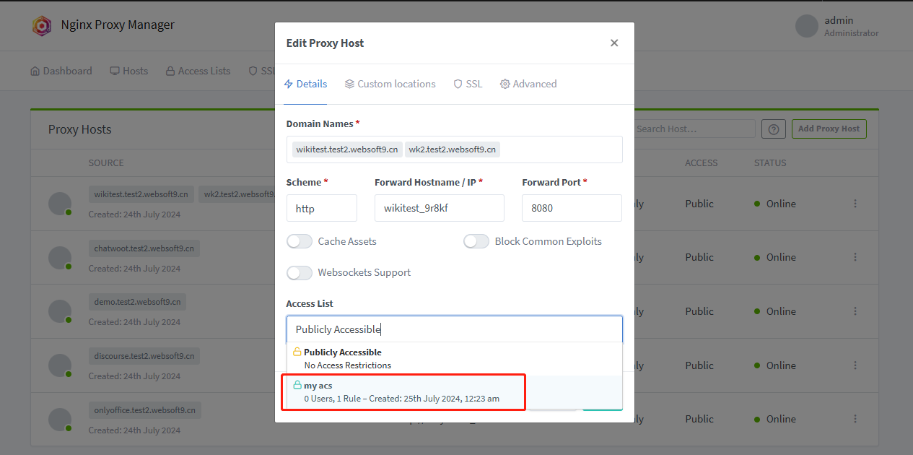

# Set security access

The Websoft9 Gateway manages and controls access to applications based on Nginx HTTP Basic Authentication and Nginx HTTP Access. 

## Why application access control?

Application access control is crucial for network security. It ensures only authorized users access sensitive data and functions.   

1. **Data Protection**: Prevent unauthorized access to sensitive information, protecting it from leaks.

2. **Compliance Requirements**: Many industries have regulations like GDPR. Access control helps compliance.

3. **Avoid Internal Threats**: Internal users might cause security incidents. Access control imposes restrictions.

4. **Environment Isolation**: Access control between environments prevents unauthorized code or data copying.

5. **Audit and Monitoring**: Access control systems log user activities, aiding in monitoring and audits.

6. **Reduce Attack Surface**: Limiting access reduces potential entry points for attackers, lowering risk.

7. **User Experience**: Customized access permissions enhance user experience by showing only needed functions.


## Setting access control{#allow}

You can create access control strategy Whitelist and account password access at Websoft9 Gateway.

1. Go to Gateway interface of Websoft9 Console, and open the **Access Lists** setting

2. Click **New Access List** to create new item
   

   - Details: You strategy name
   - Authorization: Username and password
   - Access：allow your [Whitelist](https://nginx.org/en/docs/http/ngx_http_access_module.html#allow), e.g `0.0.0.0/0` allowed all IP access

## Enable access control for Proxy Host

Once you have create access control strategy, you can attach it to your Proxy Host

1. Go to Gateway interface of Websoft9 Console, edit the target **Proxy Host**

2. Select one strategy for **Access List** at **Details** tab
   


## Limiting the Rate of Requests {#conns}

A Distributed Denial‑of‑Service (DDoS) attack or excessive web scraping will make attempt to make a service, usually a website, unavailable by bombarding it with so much traffic from multiple machines that the server providing the service is no longer able to function correctly because of resource exhaustion.

1. Go to Gateway interface of Websoft9 Console, edit the target **Proxy Host**

2. Add below configurations at the **Advanced** tabs
   ```
   # 在 server 块中使用 limit_req 和 limit_conn
   limit_req zone=w9_limit_req_zone burst=300 nodelay;
   limit_conn w9_limit_conn_zone 30;
   ```

   > `limit_req` and `limit_conn` is definde at file `/data/nginx/custom/http.conf` of Websoft9