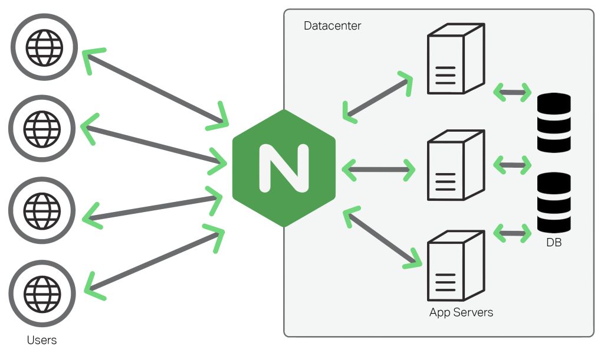

# Learning Websoft9 Gateway

User can set domain and security access by **Websoft9 Gateway** which is the core component of Websoft9.   

Websoft9 Gateway is essentially [Nginx Proxy Manager (NPM)](https://nginxproxymanager.com/guide/), and it fully retains NPM's native features.  

## Features

Nginx Proxy Manager is a web-based interface for Nginx proxy, it help users expose web services on your network easily

- Beautiful and Secure Admin Interface based
- Easily create forwarding domains, redirections, streams and 404 hosts without knowing anything about Nginx
- Free SSL using Let's Encrypt or provide your own custom SSL certificates
- Access Lists and basic HTTP Authentication for your hosts
- Advanced Nginx configuration available for super users
- User management, permissions and audit log

## Concepts

Websoft9 Gateway serves internal applications and external users, routing requests to backend servers and ensuring accurate responses, acting as a crucial bridge between clients and servers.

Using a Websoft9 Gateway offers various benefits, including:

- **Load Balancing**: Distributes traffic across servers, enhancing availability and performance.
- **Caching Static Content**: Reduces backend load by caching static content at the proxy.
- **SSL Connection**: Handles SSL encryption, offloading backend servers.
- **Security**: Hides backend server IPs, adding an extra security layer.
- **Compression and Optimization**: Optimizes and compresses response data for efficient transmission.
- **Unified HTTP Entry**: Acts as a single entry point, simplifying traffic management in complex architectures.

Websoft9 Gateway is a standalone service with multiple uses:

- As a third-party gateway, providing access control for any application.
- As a built-in Websoft9 gateway, automatically creating access control configurations.

## Related docs

- [NPM guide](https://nginxproxymanager.com/guide/)
- [NGINX docs](https://nginx.org/en/docs/)
- [NGINXConfig](https://www.digitalocean.com/community/tools/nginx)

## Troubleshoot

### Websoft9 Gateway not available when change Email?

Websoft9 Gateway not support you change administrator Email

### Can I deploy static website in Websoft9 Gateway?

Although it supports static websites, but it need uploading HTML to container, this way will breaks the architecture.  

The better deployment for static webiste refer to: [Deploy static websites by Websoft9 App Runtime](./runtime).  
