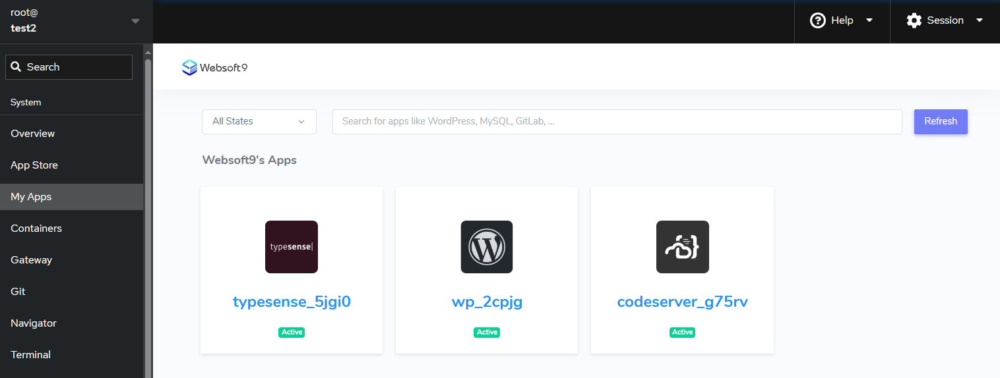
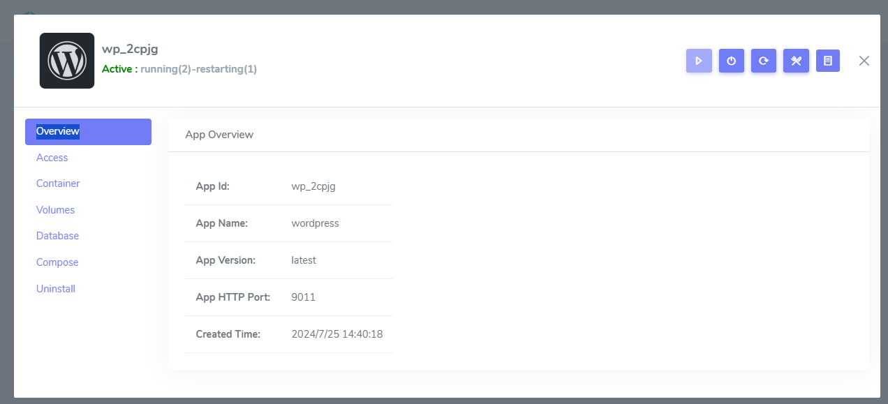
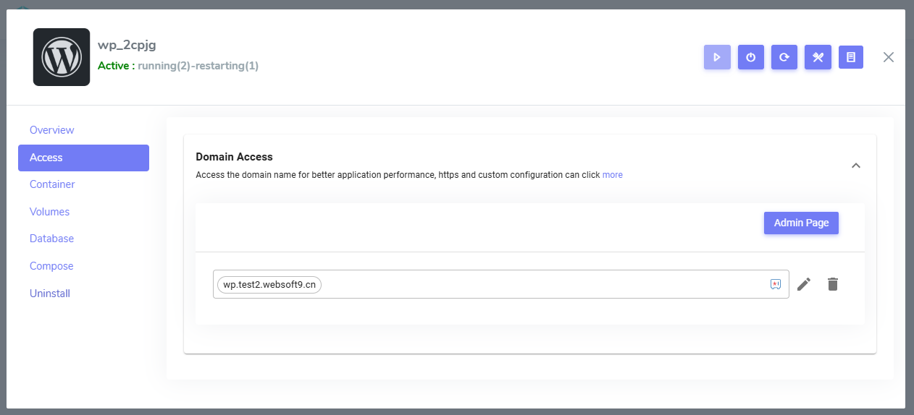
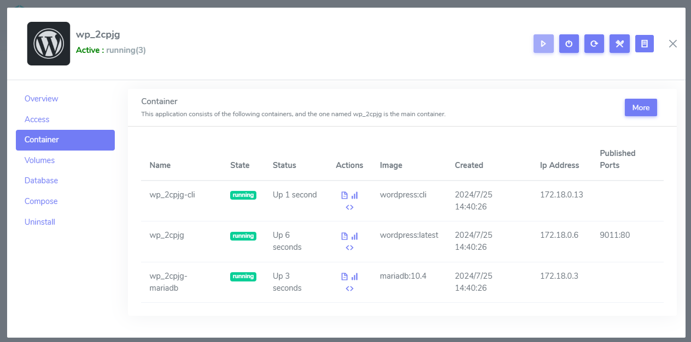
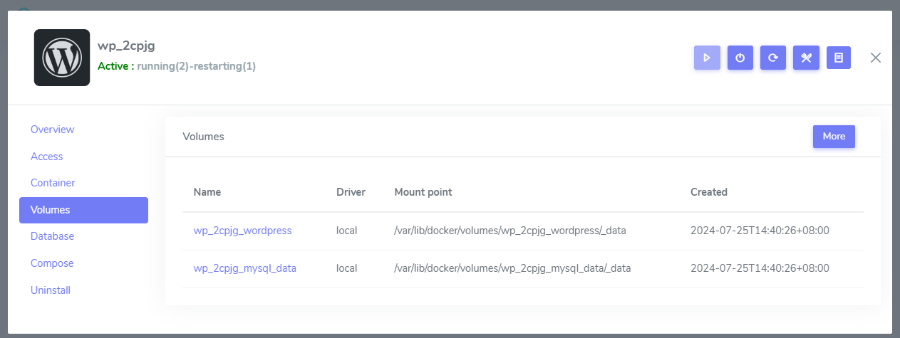
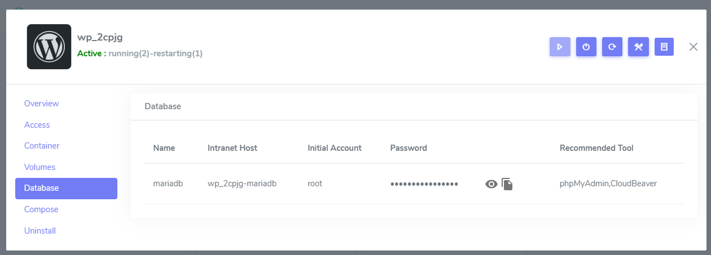

# Get application details

Websoft9 provides an application management interface for each running application, through which you can get information about the application, check the status of the application, bind the domain name, update the deployment, and other operations. 

After login to Websoft9 Console, click **My Apps** menu, it list all applications management interface.  

## Overview{#overview}

- **Application ID**: ID number containing the application name
- **Application Name**: Application template name at Websoft9 App Store
- **Application Version**: The distribution number of application template
- **Application HTTP Port**: The port of container exposed to host machine

 

## Access{#access}

Access to the application and configure access

- **Access URL**: Application URL, if not bind domain, it is `http://IP:port` 
- **Backend URI**: Application backend URL
- **Binding domain**: Bind, update or delete application domain
- **Initial credential**: Initial credential or the method how to get credential of application

## Containers{#containers}

Application containers list columns includes status, actions, host machine port: container ports, IP  

There three actions for user to manage containers

- Logs: Get [container logs](./monitor-logs), the same with `docker logs containerID`
- Stats: Container [status](./monitor-status) and [metrics](./monitor-apm)
- Exec console: [Run commands in the container](./inner-container)

## Container volumes{#volumes}

All Named [volume](https://docs.docker.com/storage/volumes) of containers

## Database{#db}

Database tab page list all database of application with connection strings that for you to connect database by web-based GUI tool includes: [phpMyAdmin](./phpmyadmin), [pgAdmin](./pgadmin) and other tools

   - Name: Database type, e.g MySQL, PostgreQL
   - Intranet host: Intranet host name for database connection

    

