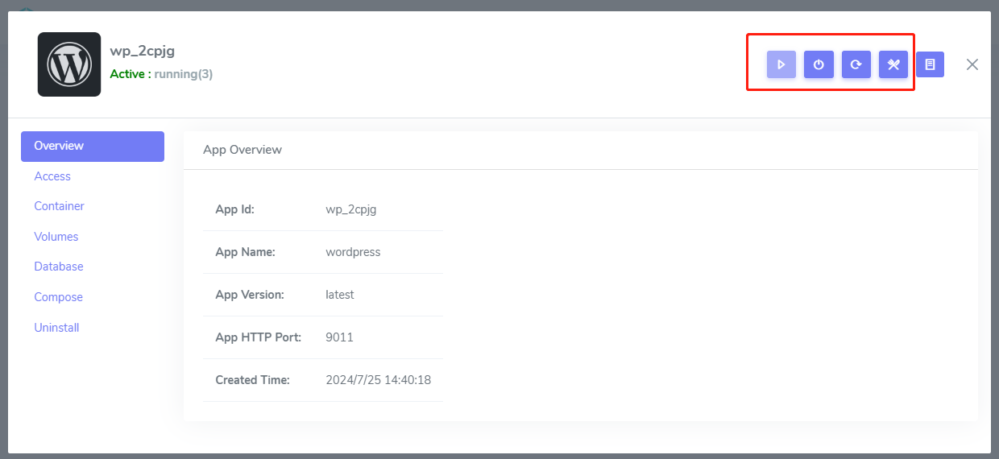
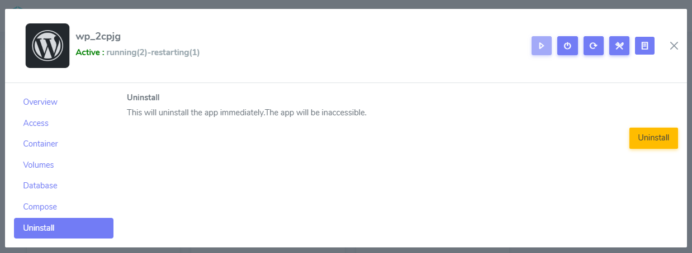
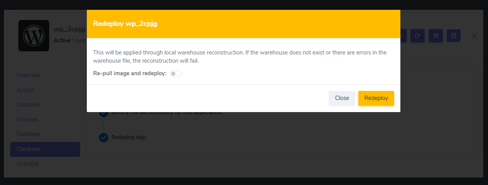

# Manage application lifecycle

Websoft9 simplify the main operations of the application: start, stop, restart, redeploy, uninstall, and so on.



## Stop application{#stop}

Start application only stop all running containers

## Start application{#start}

Start application only start all stopped containers

## Restart application{#restart}

Restart application will restart all containers

## Uninstall application{#uninstall}

The Uninstall Application operation contains several items that will be uninstalled:

- Git repository
- Containers
- Docker volumes
- Gateway configs



## Redeploy application{#redeploy}

Redeploy application is a critical Websoft9 operation designed to **[Update your deployment](./app-compose)** for your customized configs or continuous deployment while retain data.   



The main steps for redeploy application includes:   

1. Stop application and retain repository and docker volumes
2. Delete containers
3. Pull new docker image (optional)
4. Run the application from retain data

The redeploy application scenarios include the following: 

- Upgrade application to new version
- Customize application configurations and make it effective
- Clear running logs of container
- Fix bugs 
- Changes in dependent external services

## Upgrade application{#update}

You can change the version related environment by [Redeploy application](#redeploy) for upgrading application, the operation will pull your target docker image for redeployment.

## Container status in the application{#container-status}

The status of the containers in the application can reflect the state of the application.

### Running status

A running application must at least have one **running** container, but a running container doesn't always mean the service in container is running; check logs or use [healthcheck](https://docs.docker.com/compose/compose-file/05-services/#healthcheck)  to accurately determine service status.

### Exit status

When a container has an exit status, it does not indicate an application exception.  

This is means that application allows some container for one-time task, such as importing data, changing configs, and so on.  

### Restarting status

The reason for the restart status must be differentiated: 

- If application is deployed for the first time or in startup, this restarting status is reasonable
- If application is running after startup, this restarting status is abnormal


## Auto restart container{#autorestart}

The application's container restart policy is set to `unless-stopped` or `always` by default, but it only takes effect when the container is in the exited state.   

When the container's state looks normal, but the service stopped (which can be called the **unhealth** state), how can the container be restarted automatically?   

In this case, you need to add [Docker Autoheal](https://github.com/willfarrell/docker-autoheal ) as an external container in the application orchestration file, and combine it with the **healthcheck** policy of the application container, then you can realize the automatic restart.  

Here is a typical example:

```
services:

  wordpress:
    image: wordpress:latest
    container_name: wordpress
    restart: always
    healthcheck:
      test: ["CMD", "curl", "-f", "http://localhost"]
      start_period: 40s
      interval: 30s
      timeout: 10s
      retries: 3

  autoheal:
    image: willfarrell/autoheal
    container_name: autoheal
    restart: always
    environment:
      - AUTOHEAL_CONTAINER_LABEL=all
    volumes:
      - /var/run/docker.sock:/var/run/docker.sock
```