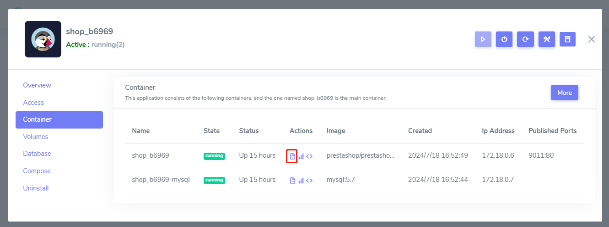

# Get logs

## Application logs

Excuse command `docker logs websoft9-apphub` to get application logs

## Container logs 

Two methods for you to get logs of containers

- Excuse command `docker logs container_name`
- Login Websoft9 Console, go to **My Apps > Application > Containers** and click logs icon of **Actions** column
  