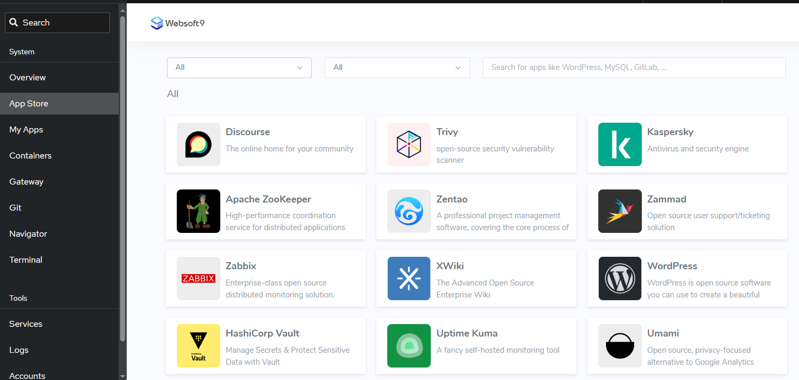
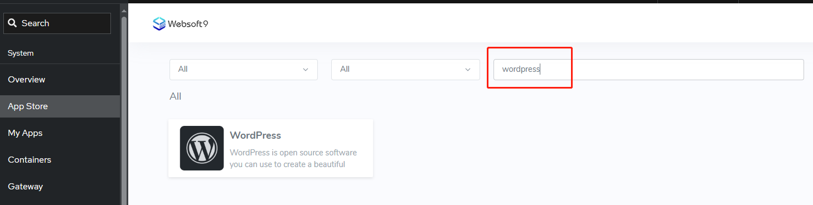
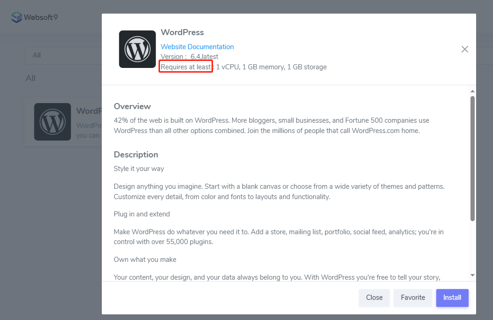
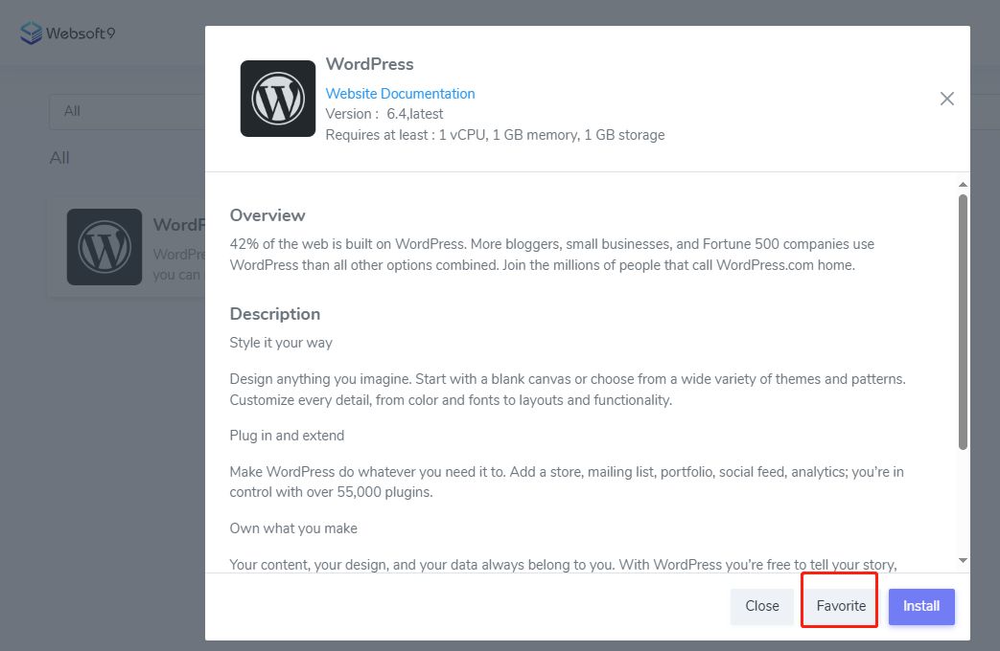
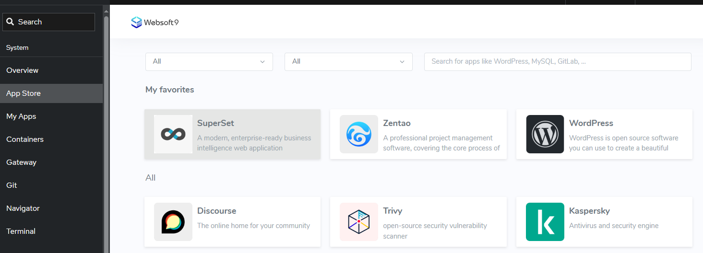

# Search templated applications

**Websoft9 App Store** centralizes hundreds of open source software and cloud-native productivity tools through a user-friendly interface one-click **deployment templates**.   

It supports categorization, filtering and favorites to install target applications.   

## Categorization

The Websoft9 App Store carries a selection of multi-level categorizations, including: data analytics, AI, websites, business operations, design creation, low-code, database, and other scenarios.  

## Keyword for search

You can search applications by keyword which related to application name, application title, application detail.  

## Application details

You can get the version, shootscreen, resource limit, documentation and other detail of application before installation. 

## Favorite applications

- You can favorite any application from application detail page
  

- You can see the favorite applications list at **App Store** default page
  
