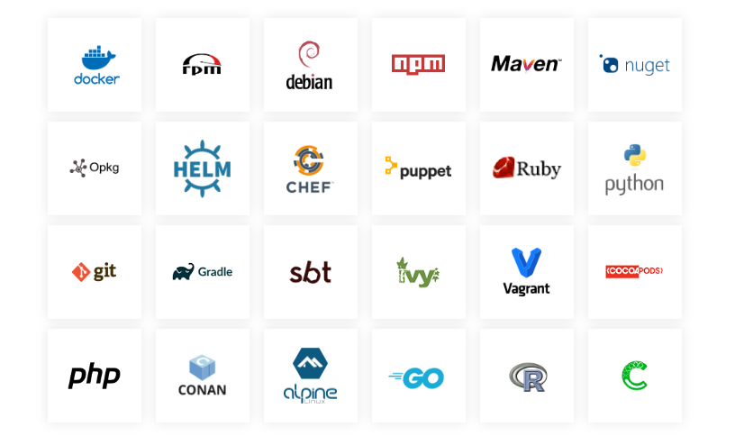

# Prepare software packages

The will be installed software packages discussed in this chapter refer to the product is named artifacts.  

In DevOps, artifacts are the outputs of the software delivery process, including compiled code (binaries), libraries, container images, configuration files, or database scripts, deployable to servers for running applications or services.

Deploy software packages isn't necessary because [Websoft9 App Store](./appstore) offers 200+ popular one-click deployment templates.   

If your application is not listed, follow the principles and tutorials to prepare the software package before installation.  

## Principles for choosing artifacts

When selecting and using artifacts in software deployment, follow these principles to ensure smooth processes and product quality:

- **Image First**: Prefer Docker images for installation to enhance deployment efficiency.
- **Official First**: Use artifacts provided by the software's original authors.
- **Availability**: Artifacts should be easily accessible from a stable and reliable source.
- **License Compliance**: Ensure the artifact's license meets your project and legal requirements.
- **Maintenance and Support**: Choose artifacts with good maintenance records and active support.
- **Documentation and Resources**: Prefer artifacts with detailed documentation and learning resources.
- **Dependency Management**: Artifacts should integrate easily with existing dependency tools.
- **Version Control**: Artifacts should have a clear version control strategy.
- **Compatibility**: Choose artifacts compatible with your development and deployment environment.
- **Reliability**: Prefer artifacts that are well-tested and proven to be stable.

Choosing artifacts involves evaluating, testing, and team decision-making.

## Build your artifact repository

Building your own Artifact repository provides better control, security, customization, and integration with existing workflows, ensuring efficient artifact management tailored to your specific needs.

If there not suitable artifacts for you, you should build your own artifact repository by below open source software:   

- JFrog Artifactory
- Sonatype Nexus
- Apache Archiva。

## Artifacts and Git repository relationship  

An artifact repository manages your end-to-end artifact lifecycle and supports different software package management systems while providing consistency to your CI/CD workflow. It’s a source for artifacts needed for a build and a target to which artifacts generated during a build process may be deployed.  

Git is a distributed version control system that tracks changes in source code and other files. It allows multiple developers to work on a project simultaneously without interfering with each other's work.  

Both artifact repositories and [Git repositories](./plan-git) are version-controlled file storage systems. Git repositories typically reference artifact repositories, making Git downstream in the process.

In the Websoft9 deployment architecture, a Git repository stores deployment automation or IaC code that references packages in the artifact repository as the deployment source.  

In fact, most Git software, such as GitLab, Github, Gitea, etc., provides the ability to repository Artifacts. 

When use Websoft9 to deploy application, you may also [Create Artifacts repository at Git system](./plan-git#create).  