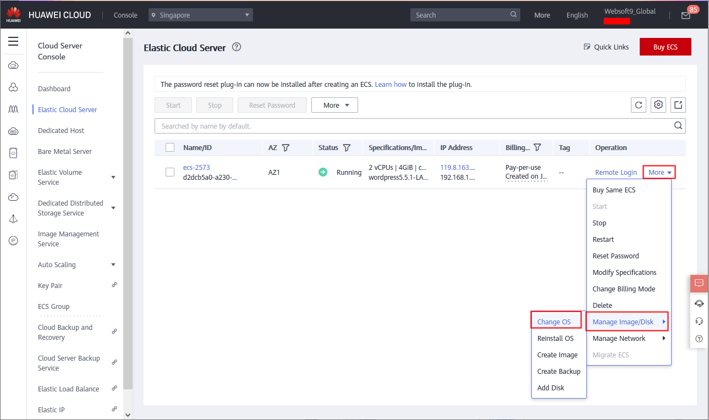
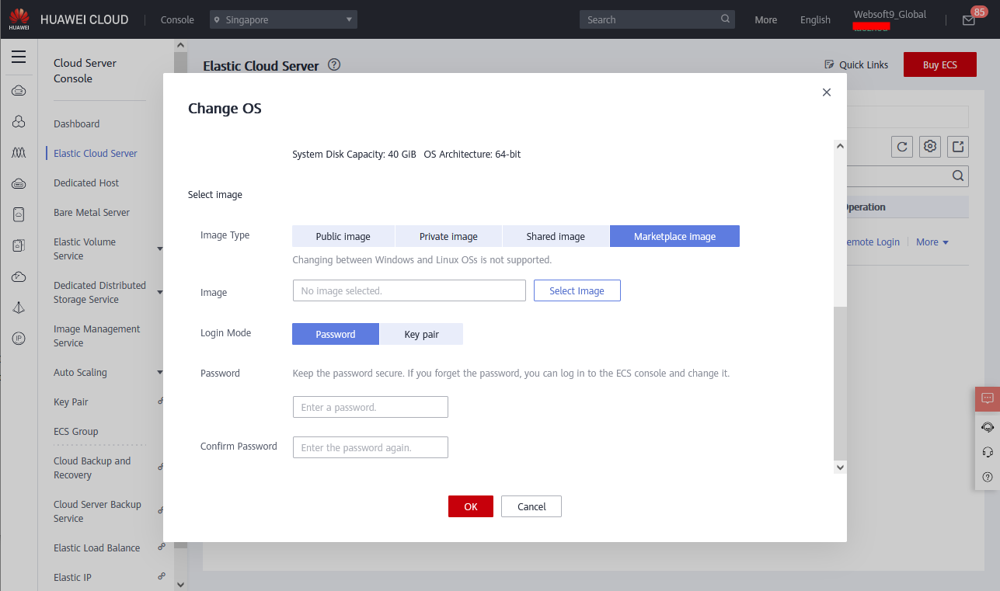

# HUAWEICLOUD

For users of the HUAWEICLOUD, Websoft9 has a pre-configured offering in the [HUAWEICLOUD Cloud Marketplace](https://marketplace.huaweicloud.com/intl/contents/bf4480ae-d0af-422c-b246-e2ec67743f4e). This tutorial describes installing Websoft9 Enterprise Edition in a single Virtual Machine (ECS).   

## Prerequisite

You need an account on HUAWEICLOUD. Use of the following methods to obtain an account:

- If you or your company already have an account with a subscription, use that account. 
- If not, you can open your own [HUAWEICLOUD account for free](https://activity.huaweicloud.com/free_test/index.html) that gives you 100+ product trials. 

## Deploy Websoft9

HUAWEICLOUD supports various ways to deploy Websoft9, essentially via ECS image creation. 

Before deployment, you should understand ECS [requirements](./install-requirements#server) first.   

### From HUAWEICLOUD Marketplace

1. Open the product [Websoft9 applications hosting platform](https://marketplace.huaweicloud.com/intl/contents/bf4480ae-d0af-422c-b246-e2ec67743f4e) at [HUAWEICLOUD Marketplace](https://marketplace.huaweicloud.com/intl/seller/791bea8ce08849cf9ae4ec61c27e8435)

2. Click **Continue to Submit** to start deploy Websoft9

3. Complete ECS creation and Websoft9 image subscription as instructed.

### From HUAWEICLOUD Console

1. Login to HUAWEICLOUD Console and enter to ECS console page

2. Select one of action to deploy Websoft9

   - Create new ECS
   - **Manage Image/Disk >Change OS** for already existing ECS
     

3. Start to deploying, at the **Image Type** configuration, select the **Marketplace image**
   

4. Input the key "websoft9 hosting" to search image of Websoft9

5. Complete ECS creation and Websoft9 image subscription as instructed.

### From RFS templates

1. Prepare [RFS template](https://www.huaweicloud.com/intl/en-us/product/aos.html) for Websoft9 deployment

2. Run this template

   - Login to HUAWEICLOUD Console, load that RFS template and run it
   - Use HUAWEICLOUD CLI/API to load that RFS template and run it

## After deployment

The deployment process will take a few minutes to complete. Once finished, you can:

1. View the details of the new ECS through the HUAWEICLOUD Console
2. [Login to Websoft9 Console](./login-console) and refer to [Post-Installation Setup](./install-setup) for next steps

## Troubleshoot

### How to get Websoft9 image ID?{#imageid}

Image ID must be retrieved via API on Huawei Cloud.

1. Login to HUAWEICLOUD and open [API Explorer](https://console.huaweicloud.com/apiexplorer) to query imageID

   - name: `websoft9-basic-Ubuntu22.04` or `websoft9-standard-Ubuntu22.04`
   - __imagetype: `market`
   - Region: [target region](https://marketplace.huaweicloud.com/contents/29458a42-64b7-4637-aa7c-8bfddea1fb72)

2. The JSON query result's **ID** is the image ID.