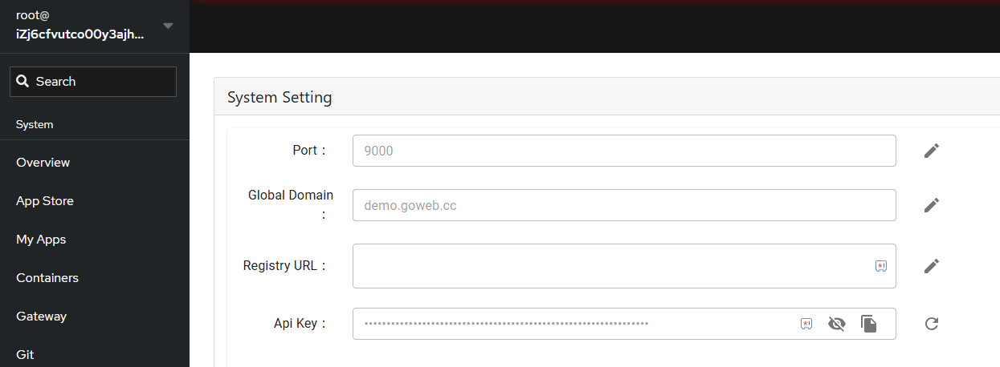
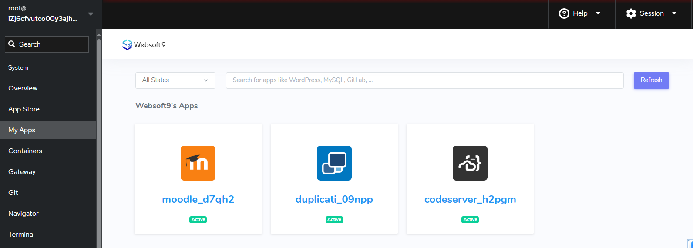
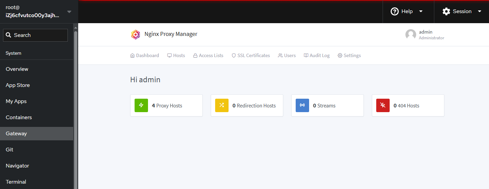

# Deploy from Websoft9 App Store

Once completed the [installation](./install) and [login to Websoft9 Console](./login-console) to verify it, you can plan to deploy applications.    

Deploy applications easily from Websoft9 App Store, featuring 200+ templates for data analysis, AI, websites, and more.

Steps to quickly deploy applications from Websoft9 App Store:  

## Step1: Set global domain

A domain is not required for Websoft9 to run. However, without a domain, application access is limited. We recommend configuring a domain for your application.  

Recommend set **a global domain** for Websoft9, it uses wildcard DNS, enabling all applications to share one domain.

For more information, see the related chapter: 

- [Set global domain for Websoft9](./domain-set#wildcard)

## Step2: Set registry-mirrors for Docker

Websoft9 pulls images online from DockerHub when deploying templated applications. You will need to set up [docker registry-mirrors](https://docs.docker.com/docker-hub/mirror/) if the server is having network issues accessing DockerHub.  

The best simple method to set it by: **Websoft9 Console > Settings > System Settings > Registry-mirrors**

## Step3: Launch your Application

On the Websoft9 Console, click on **App Store**, find the target application, and deploy it with one-click.  

For more information, see the related chapter:   

- [Explore Websoft9 template applications](./appstore)
- [Launch Websoft9 template applications](./deployment#appstore)

## Step4: Access and manage applications

After deployment application from **App Store**, get the applicaiton's overview, status, and access credentials from **My Apps**.    

In addition, [Websoft9 gateway](./gateway), provides domain binding, HTTPS setting, access and control services for applications.   

For more information, see the related chapter:   

- [Get the applicaiton's access credentials](./app-getdetail#access)
- [Managing application's status and lifecycle](./app-lifecycle)
- [Config domain and security access for applications](./gateway)
- [Set HTTPS for applications](./domain-https)

## Step5: Updating your deployment

Update your application code and configuration as needed - will automatically pull all changes to production again.   

For more information, see the related chapter:   

- [Config application and update your deployment](./app-compose) 