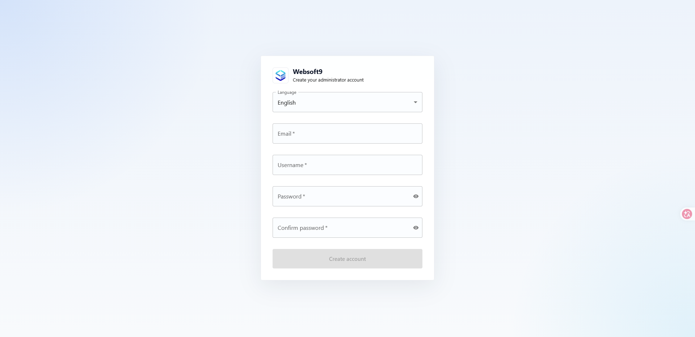
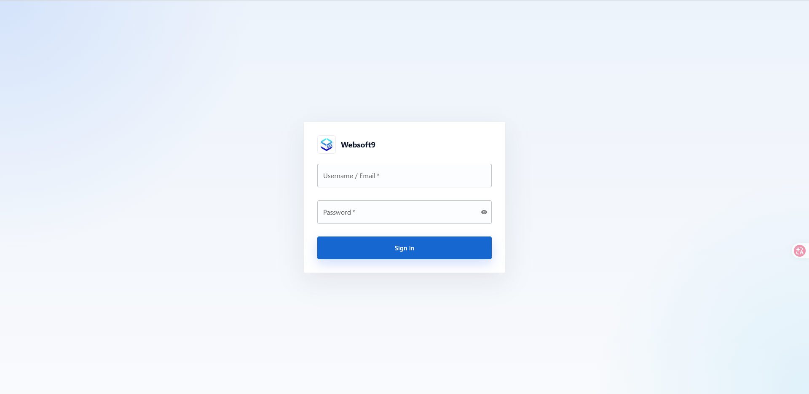
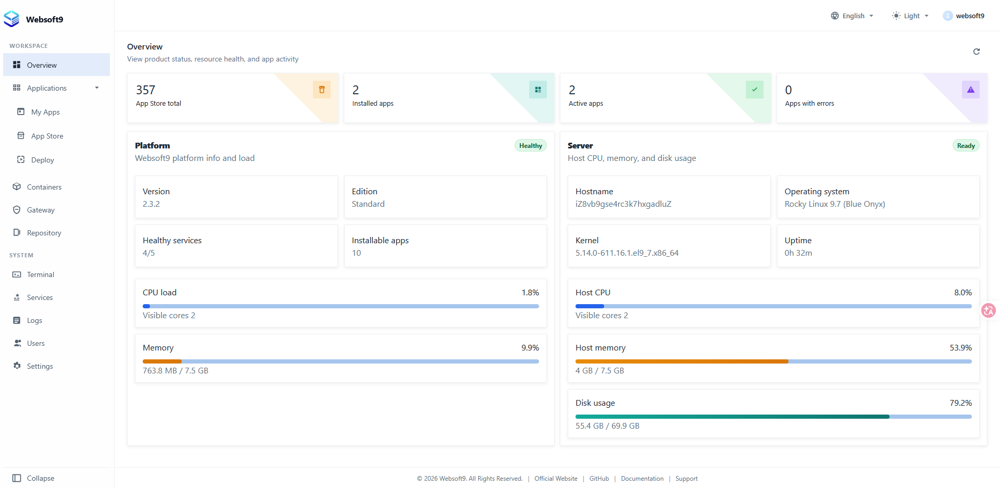

# Login to Websoft9 Console

After [installing](./install) Websoft9, you can log in to the Websoft9 Console for configuration and management.

## Prerequisites

Before logging in, ensure the following:

1. **Open inbound ports** on your cloud security group:

   - **Required**: 80, 443, 9000
   - **Optional** (for app access): 9001-9999

## First Visit

1. Open your browser and visit: `http://<server-public-IP>:9000`
2. On first visit, the **Setup Wizard** will guide you to create an administrator account and configure basic settings
   
3. After setup, log in with the administrator account you just created
   

> Websoft9 uses its own user system. The administrator account is created in the Setup Wizard and is independent of the server's operating system accounts.

## Console Overview

After logging in, you will see the console dashboard:

The left sidebar menu is organized into two sections:

**Workspace**
| Menu | Description |
|------|-------------|
| Overview | Server status dashboard |
| Apps › My Apps | Manage installed applications (start, stop, restart, redeploy, backup, compose, etc.) |
| Apps › App Store | Browse and install 200+ open source app templates |
| Apps › Deploy | Custom Docker Compose deployment |
| Containers | Manage Docker containers and images |
| Gateway | Domain binding, reverse proxy, and SSL certificate management |
| Repository | Git repository hosting and code management |

**System**
| Menu | Description |
|------|-------------|
| Terminal | Browser-based SSH terminal and file manager |
| Services | Core service status monitoring |
| Logs | Structured log viewer |
| Users | Multi-user accounts with role-based access control |
| Settings | Platform parameters, mirror acceleration, certificates, and global configuration |

## Related Topics

- [Set Global Domain for Websoft9](./domain-set#wildcard)
- [Deploy App via App Store](./appstore-guide)
- [Deploy App via Runtime](./runtime)
- [User Accounts & Credentials](./credentials)
