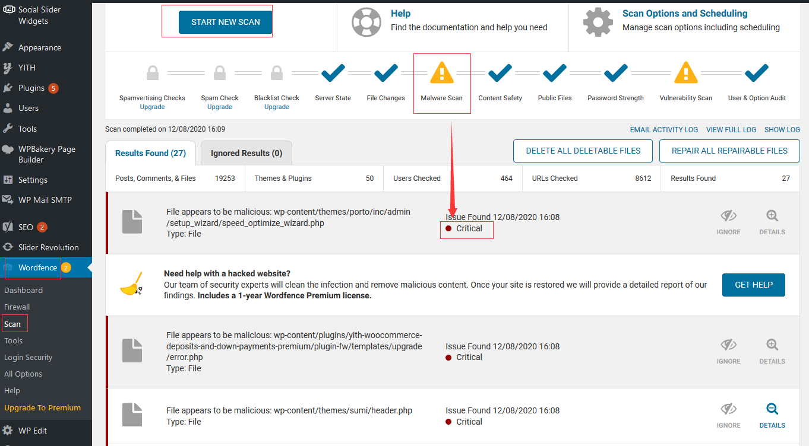

# 代码植入问题处理

代码植入是一种通过将【病毒代码】插入到应用程序或系统程序中的一种伪装方式，它通常有如下几种存在：  

* 应用程序的源码被植入
* 病毒代码以单独的文件夹形式存在
* 数据库的表中被插入数据或代码
* 系统内核被植入，产生病毒常驻进程（不容易被发现）

## 标准流程

虽然以上问题比较棘手，但实际上诊断这些问题存在标准化的流程：

1. 使用类似 [sitecheck.sucuri.net](https://sitecheck.sucuri.net/) 这种网站安全分析平台，对网站进行初步分析

2. 使用 Linux 杀毒软件 ClamAV 对系统进行全面扫描

3. 手工探索与诊断分析
   ```
   # 目录全文检索
   grep -r search_term <directory>
   
   # 查看可以进程
   ps -ef
   
   # 查看资源占用
   top
   pstree
   
   # 列出所有账号
   cat /etc/passwd
   
   # 查看登录失败的日志（看有哪些外部尝试登录的攻击）
   lastb
   
   # 查看登录成功的日志
   last
   
   # 检测是否有 SSH 隧道（scp 登录或隧道登录会显示 @notty）
   ps -ef | grep -v grep| grep "sshd: root@notty"
   
   # 多维度检测 ssh 登录列表
   netstat -antup | grep ssh
   ps auxf | grep ssh
   ps auxf | grep notty
   
   # 检查定时任务
   crontab  -l
   ```
4. 使用[Datalog](https://www.datadoghq.com/) 或 [Cloudcare](https://www.cloudcare.cn/) 这种在线的监控平台，对系统进行深度的分析。
5. 根据分析结果进行处理 

## 范例：WordPress 代理植入处理

下面以 WordPress 为例，介绍系统被代码植入后的处理方案。  

1. 通过在线安全检查网站[sitecheck.sucuri.net](https://sitecheck.sucuri.net)进行排查，初步定义被植入的内容

3. 登录WordPress后台，安装安全插件[Wordfence Scan Enabled](https://wordpress.org/plugins/wordfence/)

5. 运行 Wordfence Scan Enabled，启动网站健康检查
   
   
4. 对于【Critical】标记的结果，手工一一处理

## 范例：锁定与解锁文件系统

锁定文件系统建议使用云平台提供的【网页防篡改】进行保护。  

而需要修改的时候，也需要到平台进行解锁，否则会出现 "Operation not permitted" 的问题

```
$ chmod 750 index.php
chmod: changing permissions of ‘index.php’: Operation not permitted
$ lsattr index.php
-------------e-- index.php
```


## 扫描工具

其他扫描工具：

1. Quttera Web Malware Scanner 
2. Anti-Malware Security and Brute-Force Firewall 
