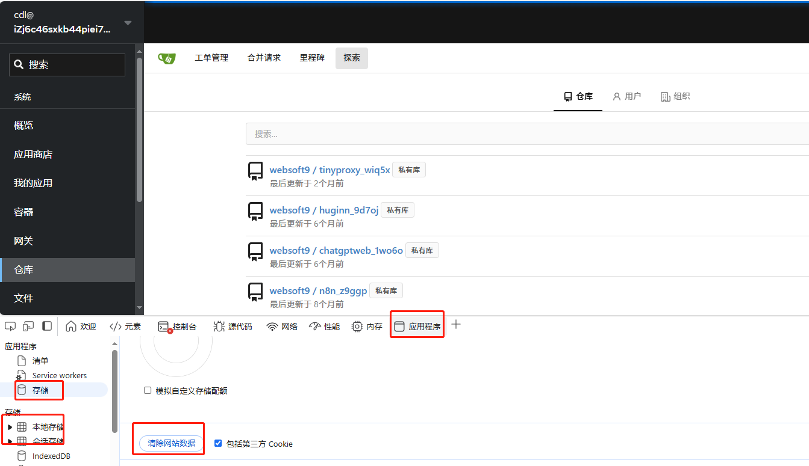

# Websoft9 升级

## 升级 Websoft9

Websoft9 控制台的【设置】页面提供了自动化的在线升级方案。  

也可以使用下面的一键升级脚本:
```
wget -O install.sh https://websoft9.github.io/websoft9/install/install.sh && bash install.sh --execute_mode "upgrade"
```

## 故障处理

升级后，可能出现的故障

#### 网关、仓库 等功能打不开？

**描述**：登录 Websoft9 后，网关、仓库等功能界面进不去，显示网络超时的错误   
**分析**：升级后本地浏览器缓存数据与服务器端不匹配
**方案**：清除本地浏览器缓存

下面是 Microsoft Egde 浏览器下清除缓存的范例：键盘 F12 进入浏览器的检查（开发者调试）模式后参考下图操作



