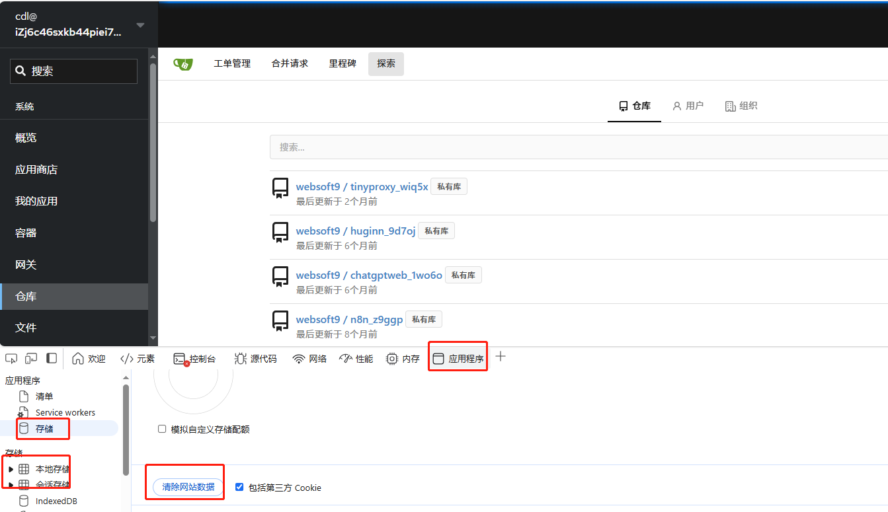

# Websoft9 升级

## 升级 Websoft9

安装脚本同时支持**全新安装**和**升级**，会自动检测当前环境。升级前建议先备份数据。

```
wget -O install.sh https://artifact.websoft9.com/websoft9/release/install.sh && sudo bash install.sh
```

> 升级过程不会影响已部署的应用。

## 故障处理

#### 升级后部分功能界面无法打开？

**描述**：登录 Websoft9 后，网关、仓库等功能界面进不去，显示网络超时的错误   
**方案**：清除本地浏览器缓存

下面是 Microsoft Edge 浏览器下清除缓存的范例：键盘 F12 进入浏览器的检查（开发者调试）模式后参考下图操作



