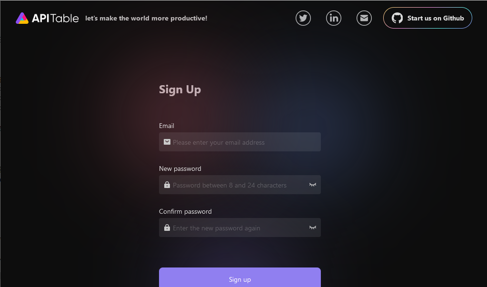
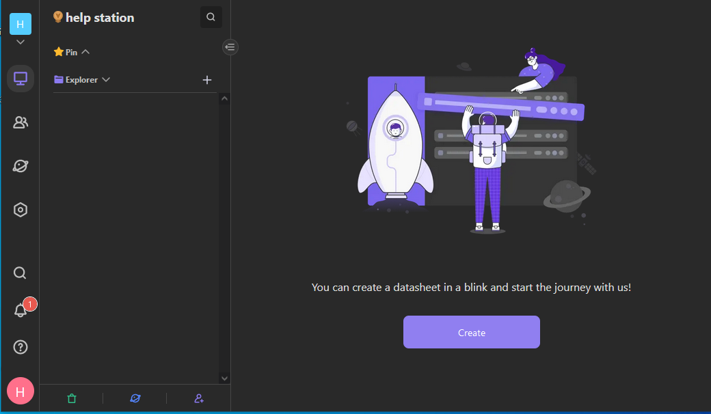

import Meta from './_include/aitable.md';

<Meta name="meta" />

## 入门指南{#guide}

### 初始化{#wizard}

Websoft9 控制台安装 AITable 后，通过 **我的应用** 查看应用详情，在 **访问** 标签页中获取登录信息。  

1. 使用本地电脑浏览器访问后，进入 AITable 首次注册页面
   

2. 注册管理员账号，即可开始使用
   

### 快速使用

参考官网文档：[AITable入门](https://help.aitable.ai/docs/guide/tutorial-1-quick-start)

## 企业版

### 为什么通过 Websoft9 购买？

Websoft9 是 AITable 的合作伙伴，我们与 AITable 合作在全球主流的云市场上提供了 AITable 的镜像交付产品。 

通过 Websoft9 采购，企业可以更多价值：

- 优惠的折扣
- 私有化部署服务以及全面的托管支持
- 业务系统开发定制服务 

### 如何购买

联系 [Websoft9 客户成功团队](./helpdesk)，立即进入专业的企业购买流程。  

## 配置选项{#configs}

- 服务器最低配置：4 CPUs/8GB RAM
- 多语言（✅）：**My Settings > Preferences > Language**
- [REST API](https://developers.apitable.com/api/reference/)

## 管理维护{#administrator}

## 故障
