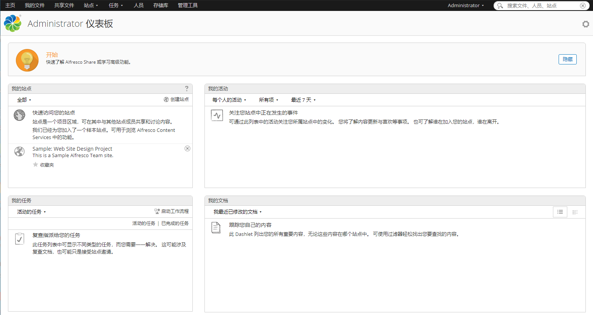
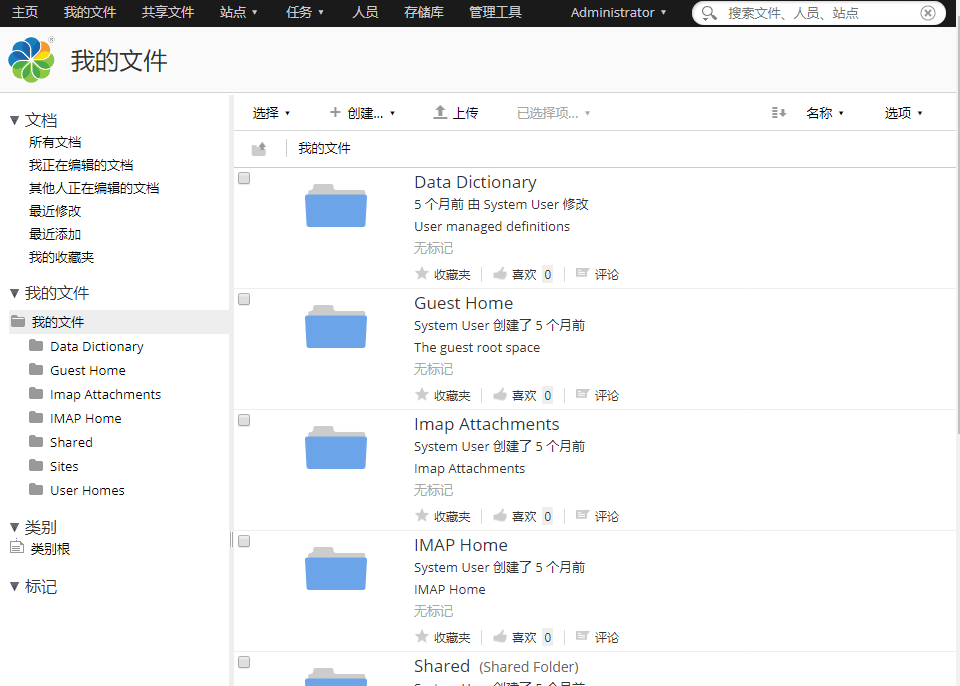
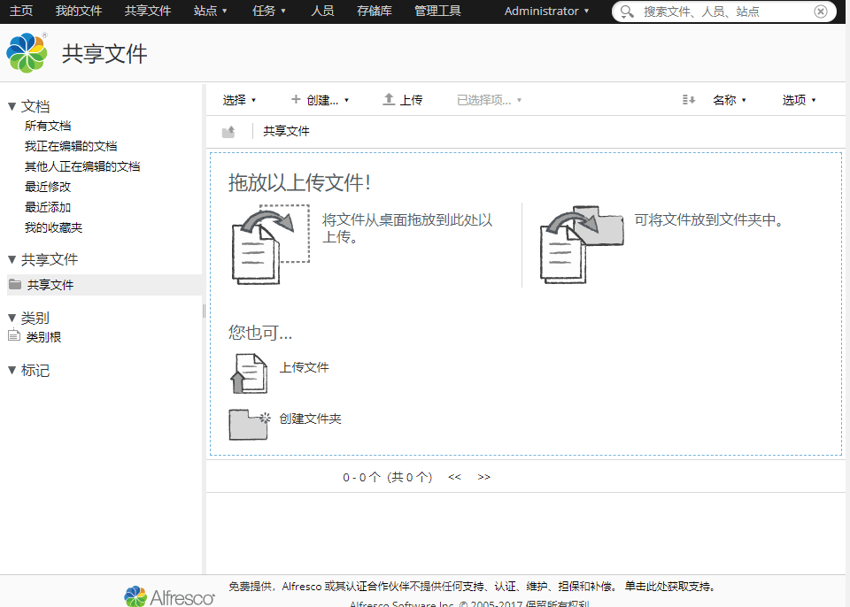
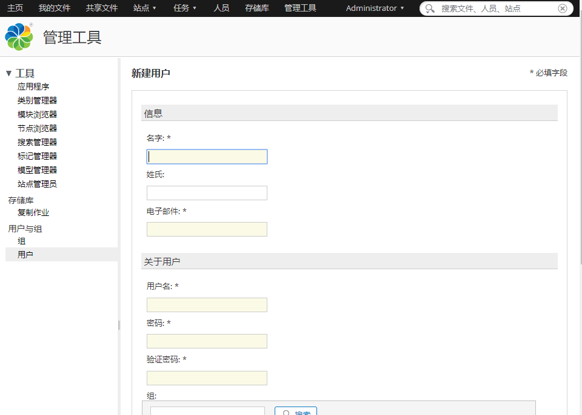
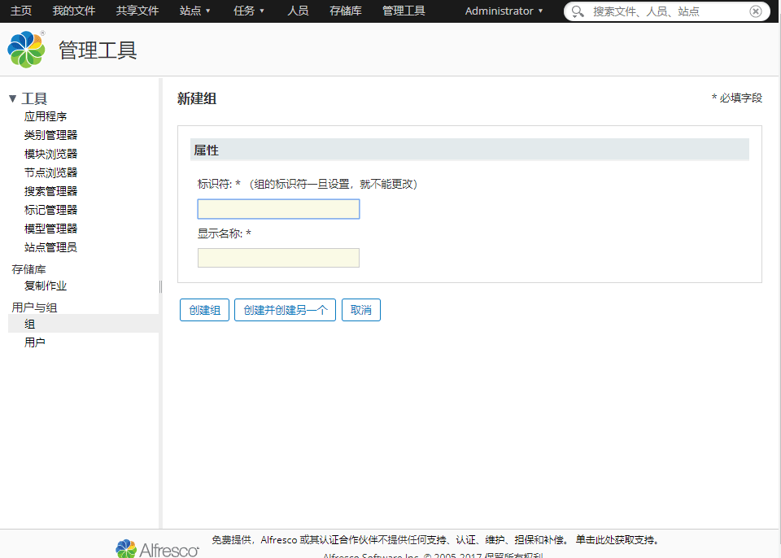
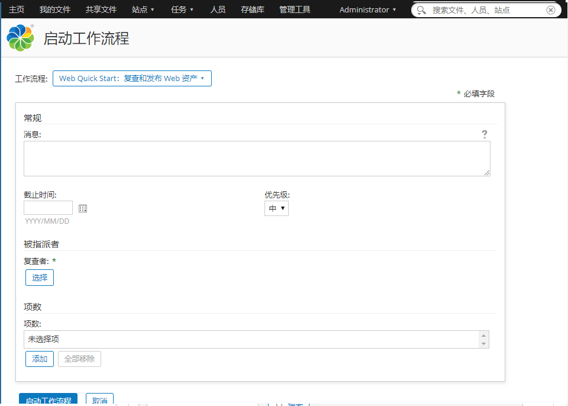

import Meta from './_include/alfresco.md';

<Meta name="meta" />

## 入门指南{#guide}

### 登录后台{#wizard}

1. Websoft9 控制台安装 Alfresco 后，通过 "我的应用" 查看应用详情，在 "访问" 标签页中获取登录信息

2. 耐心等待 10 分钟，直至 Alfresco 首次安装初始化完成

3. 本地浏览器访问 URL，出现页面后，点击 **Alfresco Repository > Alfresco Share** 可进入登录界面

4. 登录到 Alfresco 后台开始使用
   

### 功能一览

常用的功能以及截图如下：  

- 后台仪表盘
  

- 我的文档
  

- 共享文档
  

- 增加多用户
  

- 增加组（部门）
  

- 工作流（审批）
  

### 文档编辑

参考：[Files and folders](https://docs.alfresco.com/content-services/community/using/content/files-folders/)

## 配置选项{#configs}

- 多语言（✅）：Alfresco 会根据客户端浏览器来自动适配语言，也可以自行在后台设置
- SMTP（✅）
- [Alfresco Community Edition vs Alfresco Content Services Enterprise](https://www.alfresco.com/alfresco-content-services-enterprise-vs-alfresco-community-edition)
- [Alfresco 支持的文件格式](https://www.alfresco.com.cn/alfresco-formats)
- 数据存储目录：dir.root
- 元数据：Alfreco 会自动对上传的文件创建后缀为 metadata.properties.xml 的[元数据文件](https://docs.alfresco.com/content-services/latest/develop/repo-ext-points/metadata-extractors/)
- 官方文档：[Alfresco Documentation](https://docs.alfresco.com/content-services/community/using/content/) 
- 官方视频：[Alfresco Videos](https://docs.alfresco.com/content-services/latest/tutorial/video/)
- [ReST API Guide](https://docs.alfresco.com/content-services/latest/develop/rest-api-guide/)
- 修改密码：Alfresco 后台，右上角依次打开：**Administrator > 我的个人档案**

## 管理维护{#administrator}

- 找回密码：连接到数据库，运行 SQL 命令 `UPDATE alf_node_properties SET string_value='209c6174da490caeb422f3fa5a7ae634' WHERE node_id=4 and qname_id=10`，密码重置为 **admin**
- 备份与恢复：[Back up and restore](https://docs.alfresco.com/content-services/community/admin/backup-restore/)

## 故障

#### 中文 Markdown 格式预览乱码？

故障描述：*在浏览器中查看*不乱码，但是在 Alfreco 内置 document-details 中乱码  
问题原因：未知   
解决方案：暂无  
