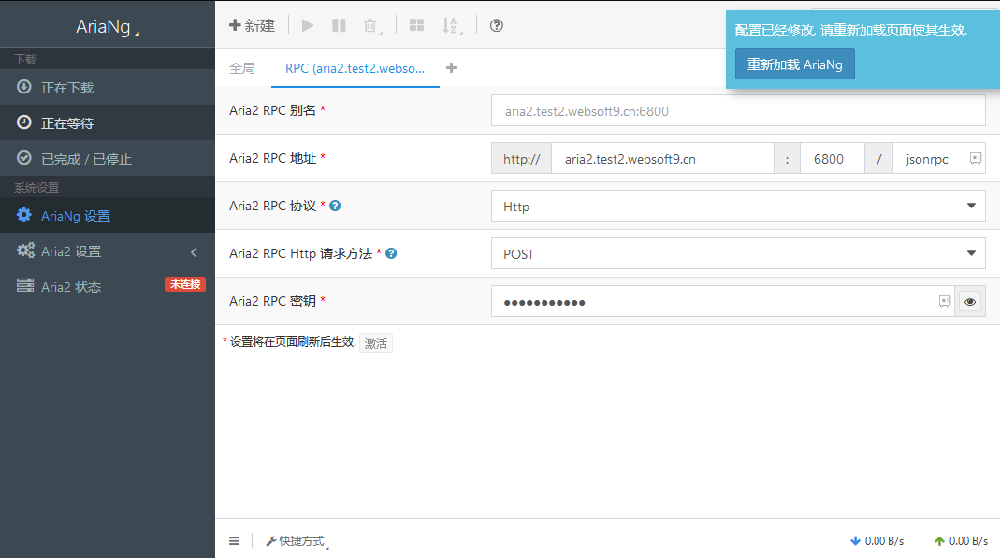

import Meta from './_include/aria2.md';

<Meta name="meta" />

## 入门指南{#guide}

### 连接 Aria2 RPC 服务{#wizard}

Websoft9 控制台安装 Aria2 后，通过 "我的应用" 查看应用详情，在 "访问" 标签页中获取 RPC 服务连接信息。

1. 本地电脑浏览器访问后，进入 AriaNg 页面

2. 【AriaNg 设置】配置 RPC 的连接信息

   - 地址：http:Aria2 访问地址
   - 端口：RPC 端口

    

3. 重新加载 AriaNg 页面，连接成功状态变为已连接

## 配置选项{#configs}

- 多语言（✅）：可在【AriaNg 设置】菜单设置语言

## 管理维护{#administrator}

## 故障

#### Aria2 连接失败？

确保 Aria2 的 RPC Secret 正确。例如：密码中包含 @ 会导致无法设置密码。  