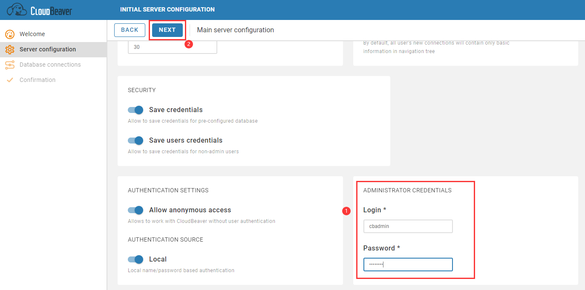
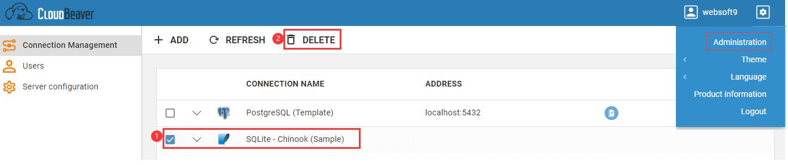
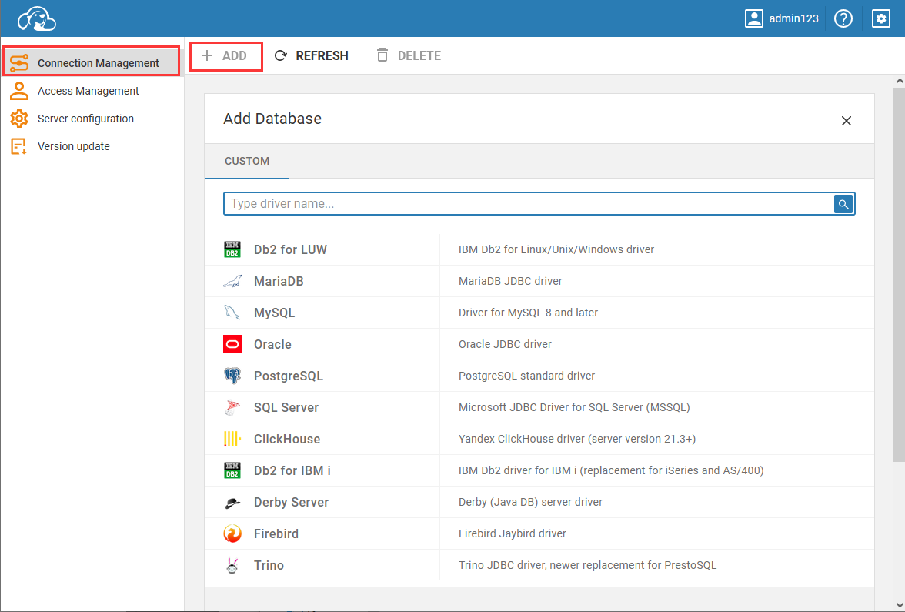
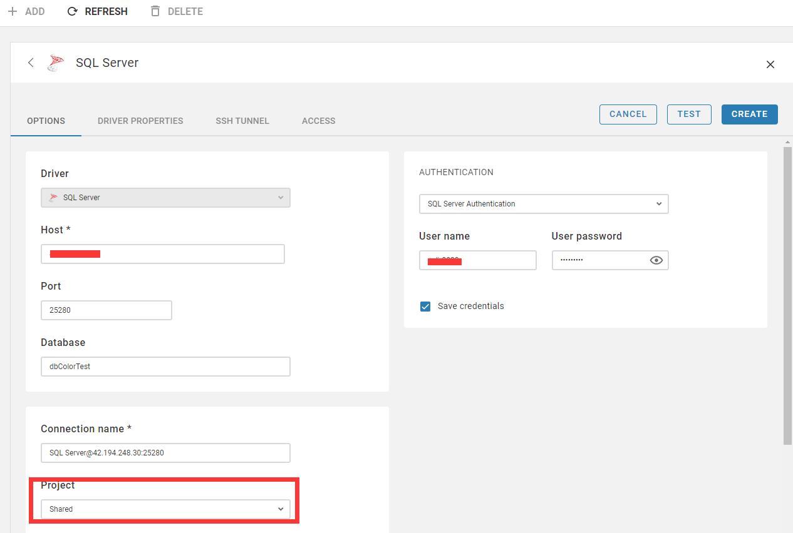
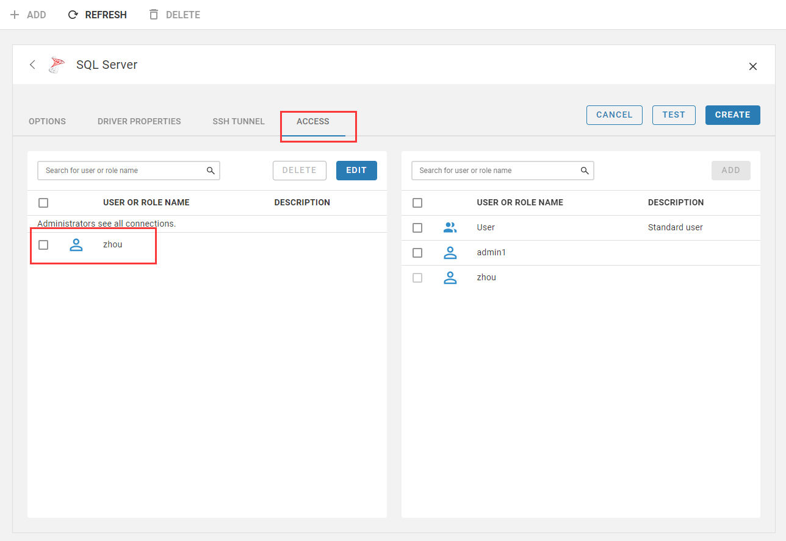

import Meta from './_include/cloudbeaver.md';

<Meta name="meta" />

## 入门指南{#guide}

### 准备数据库

CloudBeaver 是用于管理数据库的工具，如果没有数据库，可以通过 Websoft9 应用商店安装。 

- Websoft9 应用商店提供了包括：MySQL/PostgreSQL/SQLite/SQLServer/Oracle等数十个数据库的一键安装模板
- 通过 Websoft9 安装的数据库，可以通过应用ID 作为 Host 来与 CloudBeaver 连接，无需开启外网端口

### 验证 CloudBeaver {#wizard}

Websoft9 控制台安装 CloudBeaver 后，通过 "我的应用" 查看应用详情，在 "访问" 标签页中获取登录信息。  

1. 使用本地电脑浏览器访问 URL，登录后点击 **NEXT** 按钮，直至 **FINISH** 完成
   

2. 通过：**Administrator > Connection Management**，删除 **SQLite - Chinook (Sample)**，避免遭受 SQL 注入攻击
   

3. 再回到主页，默认的 SQLite 演示连接已经不存在

### 管理数据库

1. CloudBeaver 控制台，右上角**Settings > Administration > Connection Management**，添加所需的数据库连接。
   

2. 设置连接信息：主机地址、端口、账号密码（可以勾选是否保存），然后点击**Save**

3. 测试连接可用性

### 共享数据连接

共享数据连接是指管理员可以通过更改连接配置来向用户团队授予共享连接访问权限。

1. 配置连接为 Shared（共享）

   

2. 向用户授权

   

## 配置选项{#configs}

- 多语言（✅）：不支持中文
- 数据库连接驱动：JDBC
- 配置文件：*/path/GlobalConfiguration/.dbeaver/data-sources.json*
- [支持的数据库](https://dbeaver.com/databases/)
- 导出数据（✅）：仅支持表格导出

## 管理维护{#administrator}

- 驱动管理：[Driver managements](https://cloudbeaver.io/docs/Driver-managements/)

## 故障

#### 连接 Oracle 数据库失败？

如果账号准确无误，仍然无法连接 Oracle 数据库。此时，考虑 CloudBeaver 数据库驱动是否与 Oracle 版本匹配。 
