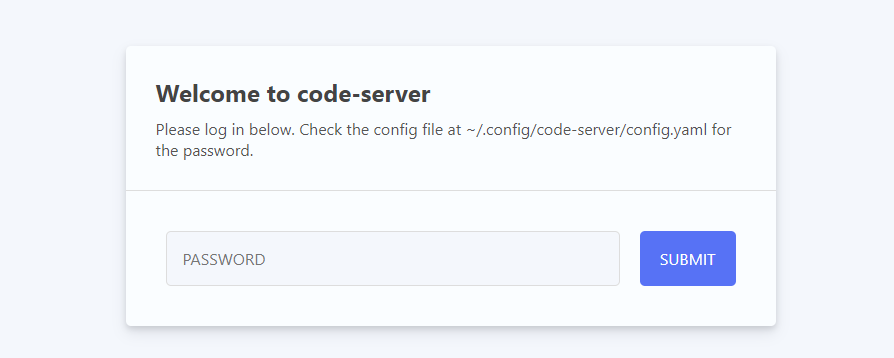
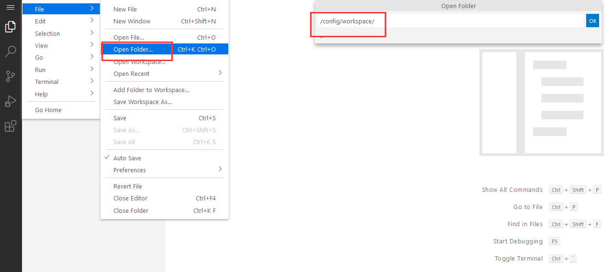
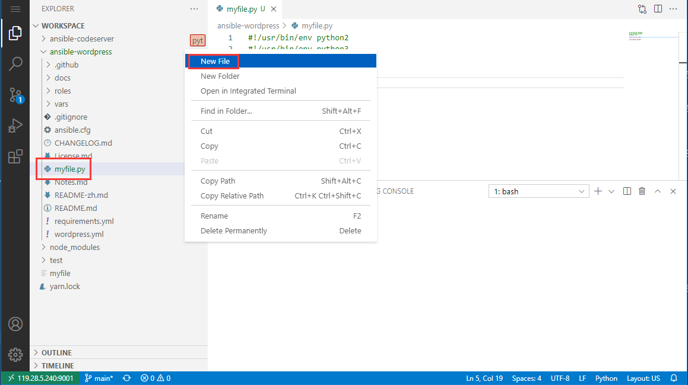
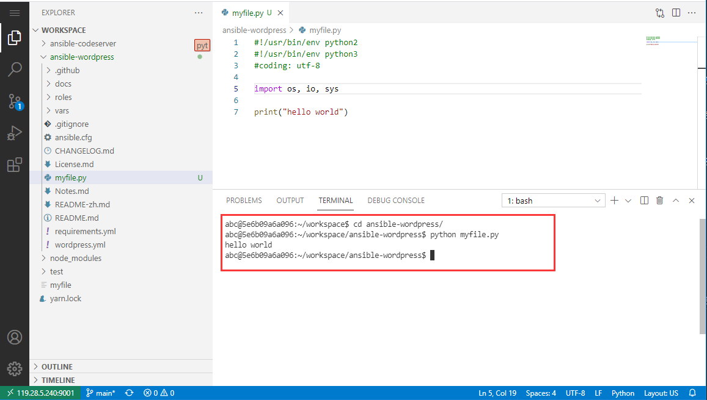

import Meta from './_include/codeserver.md';

<Meta name="meta" />

## 入门指南{#guide}

### 验证测试{#wizard}

Websoft9 控制台安装 code-server 后，通过 "我的应用" 查看应用详情，在 "访问" 标签页中获取登录信息。  

1. 使用本地浏览器访问 URL ，进入登录页面
   

2. 成功登录到 code-server 后台 
   

3. 在 code-server 后台，依次点击：**File > Open Folder**，打开 */config/workspace/* 目录
   

4. 在 code-server 后台，依次点击：**View > Terminal**，在 Terminal 区域输入测试命令
   

### 安装环境

code-sever 默认并没有安装 Python, Node, Java 等环境，因此需要在 **Terminal** 区域 `sudo su` 切换到管理员后开始安装环境。    

#### Node.js

```
# 安装 Node,yarn
curl -fsSL https://deb.nodesource.com/setup_20.x | sudo -E bash -
sudo apt-get install -y nodejs
sudo npm install --global yarn

# 删除正在运行的 npm run
ps aux
kill -9
```

#### Python

```
# 安装环境
sudo apt update
sudo apt install python3-pip
```

#### Java
```
apt update
apt install openjdk-8-jre
java -version
```

### 程序开发范例

下面以 Python 开发为范例，介绍如何使用 code-server：

1. 登录 code-server，新建一个文件夹和文件，文件命名为：*myfile.py*，并拷贝下面的 Python 程序实例代码。
   ```
   #!/usr/bin/env python2
   #!/usr/bin/env python3
   #coding: utf-8

   import os, io, sys

   print("hello world")
   ```
   

2. 在**窗口的终端栏**中执行 `python myfile.py` 命令，运行 Python 程序
   

3. 查看正确的输出结果

### 发布应用到公网

通过 code-server 发布应用到公网的具体步骤为：

1. 假设应用的运行命令如下，即运行在容器的 3002 端口
   ```
   npm run start -- --host 0.0.0.0 --port 3002
   ```

2. 通过 Websoft9 控制台的**网关**，增加一个 Proxy Hosts 转发到 **容器中的应用端口**


### 多开发者

单个 code-server 不支持多用户协同工作。多开发者，只需通过 Websoft9 控制台安装多个 code-server 多个应用。

## 配置选项{#configs}

- Terminal 中 sudo 密码：与 code-server 控制台密码相同
- 代码编译构建（✅）
- 安装扩展（✅）


## 管理维护{#administrator}


## 故障

#### 文件权限不足？

问题描述：切换到 root 账号 git clone 项目后，code-server 权限不足，导致无法修改或删除项目文件  
原因分析：code-server 容器默认用户是 abc，无法修改 root 权限的文件   
解决方案：`chown -R abc:abc /config/workspace` 修正

#### Terminal 安装组件时权限不足？

`sudo su` 切换到 root 账号

#### 无法复制命令到 Terminal？

ctrl+V

#### git push 时与远程待拉取冲突？

问题描述：  git push 时，由于有待 pull 的代码，导致冲突  
解决方案：  `git pull --rebase origin main`

#### 如何删除正在运行的进程？

先运行 `ps aux` 命令查看，再运行 `kill -9 PID`
