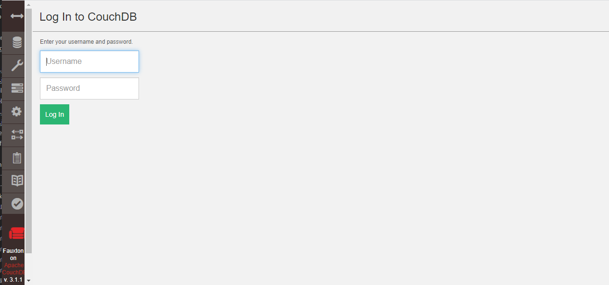

import Meta from './_include/couchdb.md';

<Meta name="meta" />

## 入门指南{#guide}

### 登录后台{#wizard}

1. Websoft9 控制台安装 CouchDB 后，通过 "我的应用" 查看应用详情，在 "访问" 标签页中获取登录信息。 

2. 本地浏览器访问 `http://URL/_utils/#login`，开始登录后台
   

## 配置选项{#configs}

- 用户自定义配置文件：通过仓库 *src/my.ini* 挂载到容器中
- 命令行：CouchDB 是 API 驱动，通过 `curl` 的方式操作数据
- [API](https://docs.couchdb.org/en/stable/api/index.html) 
- [分区](https://docs.couchdb.org/en/stable/partitioned-dbs/index.html#partitioned-databases)
- 最大连接数：2048

## 管理维护{#administrator}

## 故障