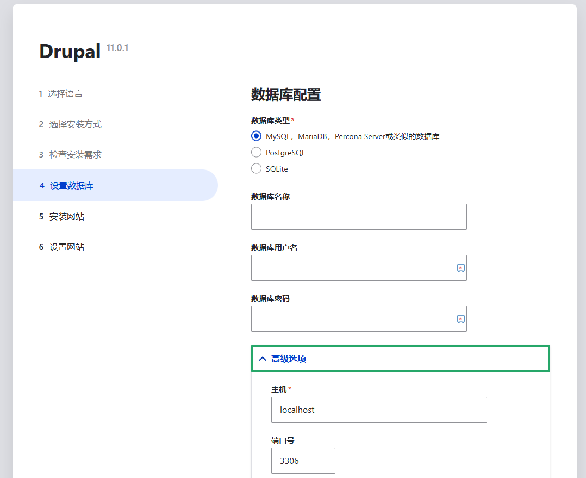

import Meta from './_include/drupal.md';

<Meta name="meta" />

## 入门指南{#guide}

### 初始化{#wizard}

1. Websoft9 控制台安装 Drupal 后，通过 "我的应用" 查看应用详情

  - 在 **访问** 标签页中获取访问 URL
  - 在 **数据库** 标签页中获取 **内网主机** 和 **密码**

2. 本地浏览器访问 URL，进入 Drupal 初始化向导

3. 默认提供的数据库配置如下：

   

      - 数据库类型：`MySQL`
      - 数据库名称：`drupal`
      - 数据库用户名：`drupal`
      - 数据库密码：步骤 1 获取的  **密码** 
      - 高级选项 > 主机：步骤 1 获取的  **内网主机** 

   > 也支持填写第三方数据库配置信息

4. 根据安装向导完成后续步骤

### 设置多语言{#setlang}

Drupal 支持多语言，但需要先安装再设置：

1. 登录 Drupal，在后台 **管理 > 配置 > 地区和语言** 中安装语言

2. 安装新语言后，再设置默认语言

### 安装主题和模块

1. 从 [Drupal Themes](https://www.drupal.org/project/project_theme) 或 [Drupal Modules](https://www.drupal.org/project/project_module) 获取下载地址

2. 打开 **扩展管理 > 安装扩展**，输入下载地址，开始 [安装](https://www.drupal.org/docs/extending-drupal/installing-modules)

3. 安装成功后再启用

## 配置选项{#configs}

- 配置文件：*/path/sites/default/settings.php*
- 多语言（✅）
- SMTP（✅）：安装[SMTP Authentication Support](https://www.drupal.org/project/smtp) 插件实现 SMTP
- [第三方 CLI](https://drupalconsole.com/) 
- [APIs](https://www.drupal.org/docs/drupal-apis)

## 管理维护{#administrator}

- [重置密码](https://www.drupal.org/node/44164) 

- 更换 URL：修改 Drupal 根目录下 `.htaccess` 中域名有关的值

- 在线备份：安装 Drupal 扩展 [Backup and Migrate](https://www.drupal.org/project/backup_migrate) 可实现在线备份策略设置


## 故障

#### 初始化 【安装翻译】时总是报错？

问题原因：安装翻译过程中需要从网络上下载翻译文件，可能会有网络超时导致错误  
解决方案：重试多次，直至成功

#### Drupal 状态报告有错误？

此“错误” 实际上是 “警告”，可以忽略

#### Protecting against HTTP ...？

现象描述：Drupal 8.x 版本以上，安装完后提示 Protecting against HTTP HOST Header attacks。  

解决方法：进入 Drupal 目录下的 settings.php 文件插入域名（注意格式）：

```
$settings['trusted_host_patterns']=['^www\.webosft9\.com$'];
```

#### 安装完成后仍提示安全漏洞？

参阅：[Trusted Host settings](https://www.drupal.org/node/1992030)
