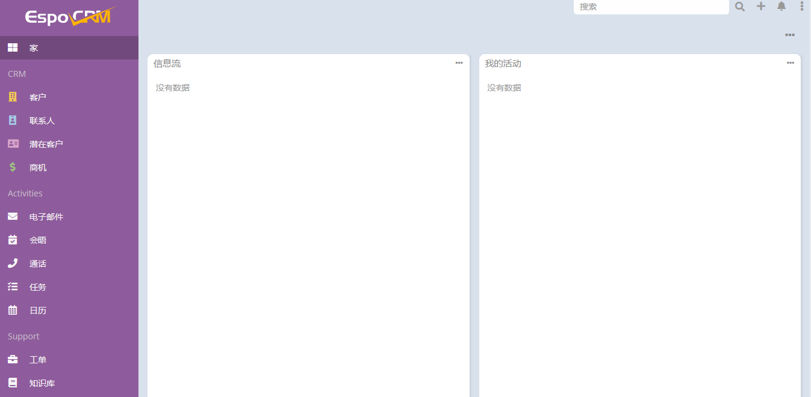

import Meta from './_include/espocrm.md';

<Meta name="meta" />

## 入门指南{#guide}

### 登录验证{#wizard}

1. Websoft9 控制台安装 EspoCRM 后，通过 "我的应用" 查看应用详情，在 "访问" 标签页中获取登录信息。  

2. 成功登录后，界面如下
   

## 配置选项{#configs}

- 多语言（✅）：通过右上角 **设置入口 > Preferences** 中设置
- 移动端（✅）
- SMTP（✅）：**后台 > Admin > 电子邮件账户**
- 命令行：[Console Commands](https://docs.espocrm.com/administration/commands/)
- API：[EspoCRM REST API](https://docs.espocrm.com/development/api/)

## 管理维护{#administrator}

## 故障
