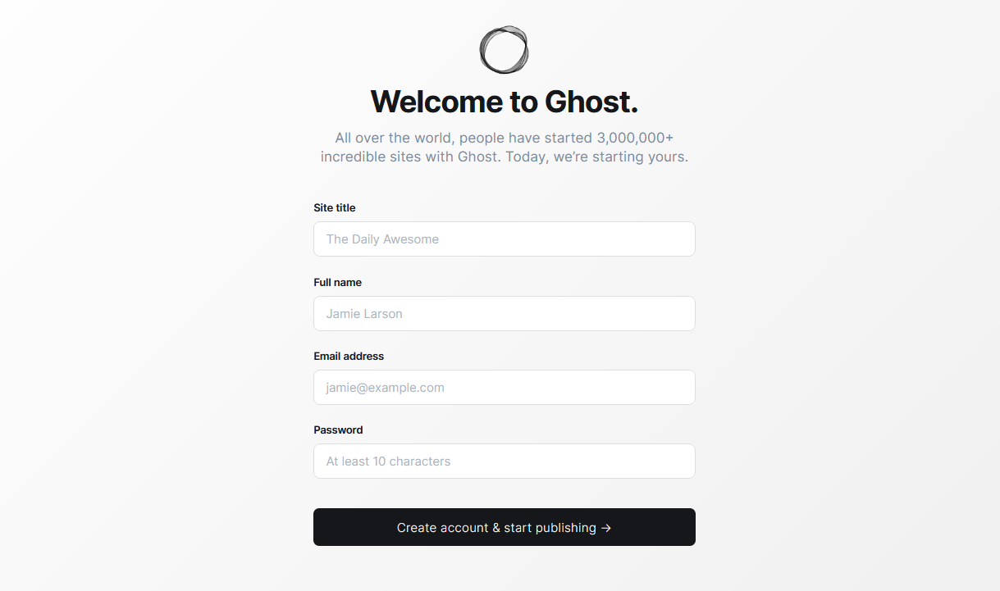
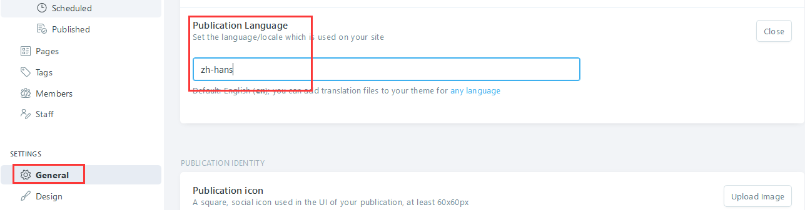
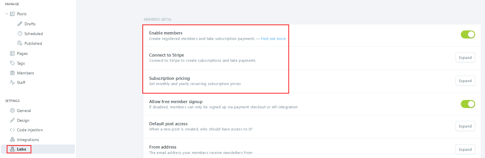

import Meta from './_include/ghost.md';

<Meta name="meta" />

## 入门指南{#guide}

### 创建账号{#wizard}

Websoft9 控制台安装 Ghost 后，通过 "我的应用" 查看应用详情，在 "访问" 标签页中获取登录信息。  

1. 使用本地电脑的浏览器访问后 `http://URL/ghost`，进入初始化
   

2. 开始创建管理员账号（邮箱地址用户名） 

### 网站多语言

Ghost 的后台不支持中文，但是前台支持中文（需主题中有中文）。

1. 主题下 locales 目录翻译文件，其中 zh-hans.json 表示中文

2. 登录到 Ghost 后台，点击左侧菜单栏的【General】，展开【Publication Language】，设置其值为：zh-hans
  

3. 保存后即刻生效


### 启用付费阅读

Ghost 支持网站向客户以订阅的方式售卖文章，是知识付费创业者的生产力工具。

1. 登录 Ghost，点击左侧菜单栏的【SETTING】>【Labs 】

2. 分别对 Enable members, Connect to Stripe, Subscription pricing 等项进行设置
  


## 配置选项{#configs}

- 代码嵌入（✅）: Ghost 后台【SETTING】>【Code Injection】

- SMTP（✅）：修改配置文件实现

- 多语言（×）：Ghost 后台不支持多语言，网站页面支持多语言

- 配置文件（已挂载）： */var/lib/ghost/config.production.json*  

- 主题目录（已挂载）： */var/lib/ghost/themes*  

- [Ghost CLI](https://ghost.org/docs/ghost-cli/)

- [Content API](https://ghost.org/docs/content-api/)

- 主题市场（✅）

- 更换主题：Ghost 左侧菜单栏的【SETTING】>【Design】，下拉到主题设置区域

- 自定义菜单（✅）：Ghost 左侧菜单栏的【SETTING】>【Design】

## 管理维护{#administrator}

- **更换 URL**：更换域名后，需重新设置 Ghost **配置文件**中 URL 相关的值 
   ```
   {
   "url": "http://ghost.yourdomain.com",
   "server": {
      "port": 2368,
      "host": "0.0.0.0"
   }
   ```

- **配置 SMTP**：通过修改 配置文件中 [mail 字段](https://forum.ghost.org/t/how-to-setup-basic-smtp-for-ghost/29166/4) 实现邮件发送


## 故障

#### 更改域名导致无法访问 Ghost ？

#### 访问 Ghost 出现 502 错误？{#502}