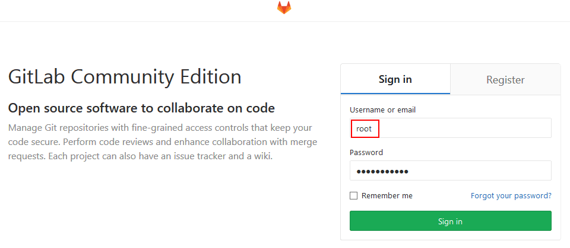
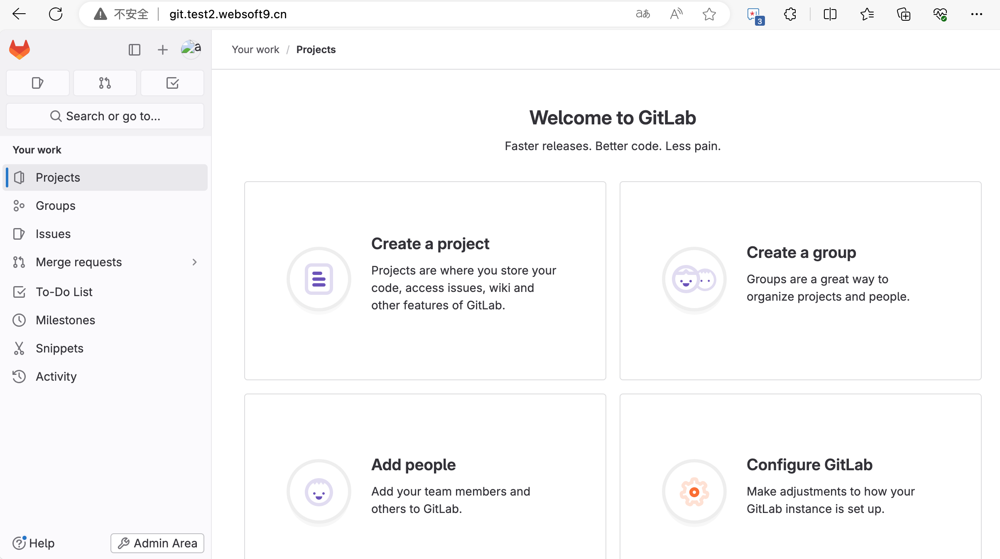
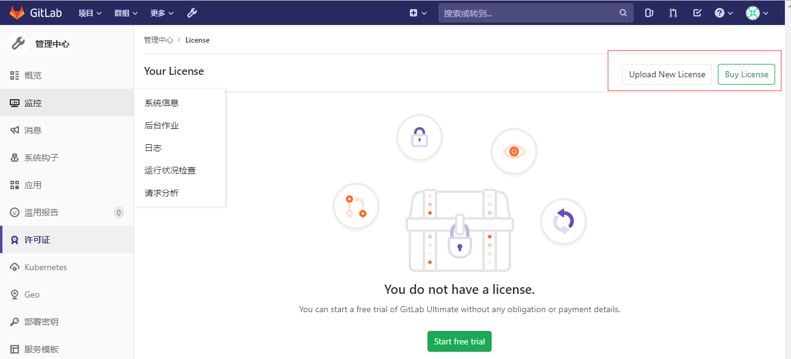

import Meta from './_include/gitlab.md';

<Meta name="meta" />

## 入门指南{#guide}

### 验证安装{#wizard}

Websoft9 控制台安装 GitLab 后，通过 "我的应用" 查看应用详情，在 "访问" 标签页中获取登录信息。  

1. 本地电脑浏览器访问后，进入登陆页面（首次加载需2-3分钟，此时切勿重启，否则导致登陆密码无效）
   

2. 输入账号密码，进入 GitLab 控制台
   

3. 开始设置语言，新建仓库，新建用户等操作


### 设置 GitLab 仓库地址{#setrepourl}

仓库地址不同于 GitLab 的控制台地址。  

参考：[Configure External URL](https://docs.gitlab.com/omnibus/settings/configuration.html#configuring-the-external-url-for-gitlab) 配置 **external_url** 项的值。

## 企业版

Websoft9 是 Gitlab（包括极狐） 的合作伙伴，通过 Websoft9 购买 Gitlab ，可以获得：

- 更优惠的折扣
- 更多的技术支持范围
- 更全面的其他 DevOpS 

### 导入 License

GitLab-EE（企业版），通过：【管理中心】>【许可证】导入后，**试用**或**启用**企业版


### CE 升级到 EE

修改镜像标签，即可无缝升级到 EE。   

详情参考官方文档：[Updating Community Edition to Enterprise Edition](https://docs.gitlab.com/omnibus/update/README.html#updating-community-edition-to-enterprise-edition)

### EE 降级到 CE

如果安装了 GitLab 企业版，在没有导入 License 的情况下使用的是 社区版的所有功能。  

[GitLab-EE vs GitLab-CE](https://about.gitlab.com/install/ce-or-ee/)

## 配置选项{#configs}

- 命令行工具：`gitlab-ctl`
- [API](https://docs.gitlab.com/ee/api/) ：`curl "https://gitlab.example.com/api/v4/projects"`
- 多语言（✅）：后台【User Settings】>【Preferences】设置语言
- SMTP（✅）：配置文件中相关值如下
   ```
   gitlab_rails['smtp_enable'] = true
   gitlab_rails['smtp_address'] = "smtp.exmail.qq.com"
   gitlab_rails['smtp_port'] = 465
   gitlab_rails['smtp_user_name'] = "xxxx@xx.com"
   gitlab_rails['smtp_password'] = "password"
   gitlab_rails['smtp_authentication'] = "login"
   gitlab_rails['smtp_enable_starttls_auto'] = true
   gitlab_rails['smtp_tls'] = true
   gitlab_rails['gitlab_email_from'] = 'xxxx@xx.com'
   ```
- 配置文件（已挂载）：*/etc/gitlab/gitlab.rb*
- [GitLab 架构](https://docs.gitlab.com/ee/development/architecture.html)：GitLab 包含[数十种组件](https://docs.gitlab.com/ee/development/architecture.html#component-list)，可通过 */opt/gitlab/version-manifest.txt* 查看

- GitLab Runner：GitLab Runner 是额外的技术组件，需自行部署

## 管理维护{#administrator}

- **重置管理员密码**：进入容器的命令模式，运行 `gitlab-rails console` 命令[重置密码](https://docs.gitlab.com/13.11/ee/security/reset_user_password.html)
- **修改仓库目录**：[Repository storage paths](https://docs.gitlab.com/ee/administration/repository_storage_paths.html)

## 故障

#### 公司固定 IP 突然不能访问 Gitlab？

**现象描述**：通过公司网络（固定IP）突然（以前可以访问）不能访问Gitlab，而通过自己的手机wifi可以访问。   

**原因分析**：GitLab 有一个 rack-attack 安全机制。某种条件下（例如：公司大量并发访问 GitLab）rack-attack 安全将你的 IP 错误地拦截，导致了从此不能访问 GitLab   

**解决方案**：修改 [Gitlab 配置文件](../gitlab#path) 的 rack-attack 相关项


#### 访问 GitLab 出现 502 错误？{#502}

**现象描述**：首次访问 GitLab 或 访问人数较多时，GitLab 出现 502 错误？   

**原因分析**：GitLab 所需内存最低为4G，若服务器配置不足，100% 会出现 502 错误。另外，对于单核CPU的服务器，Unicorn and Sidekiq 服务启动最少需要一分钟，如果没有启动完成，也会报502错误   

**解决方案**：升级服务器配置

#### 无法连接 PostgreSQL？

**现象描述**：使用数据库客户端，无法连接 GitLab 容器中的 PostgreSQL？ 

**原因分析**：默认安装下，GitLab 使用 Peer Authentication 与 PostgreSQL 通讯。这意味着客户端只能以 PostgreSQL 所在主机上的 Linux 系统账号访问数据库，无法远程访问。
