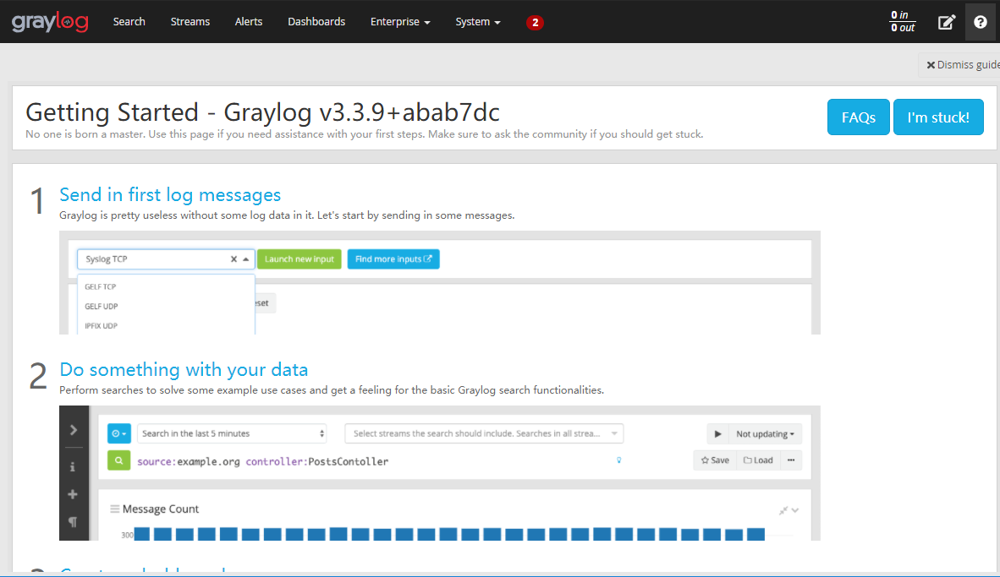
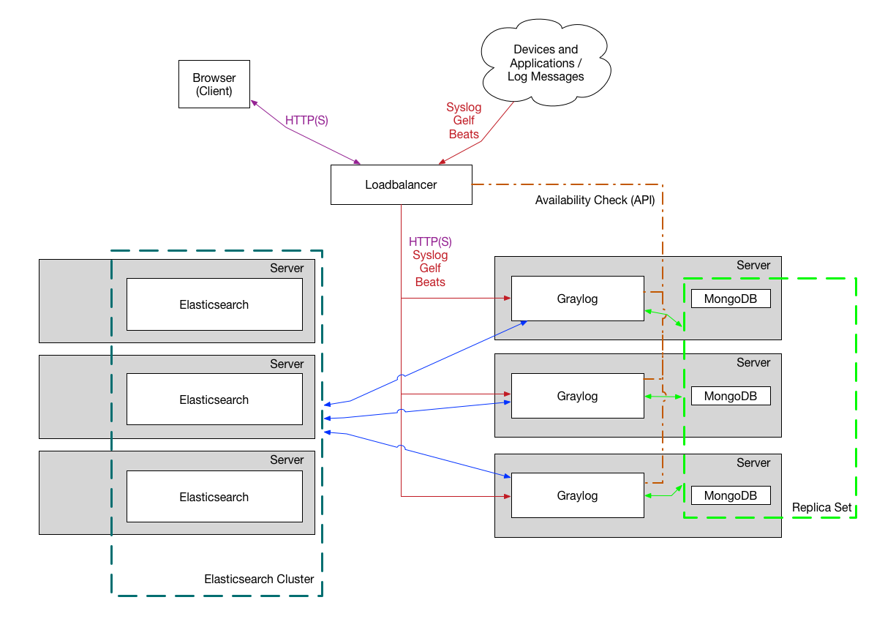
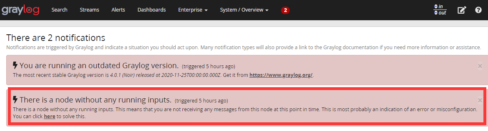
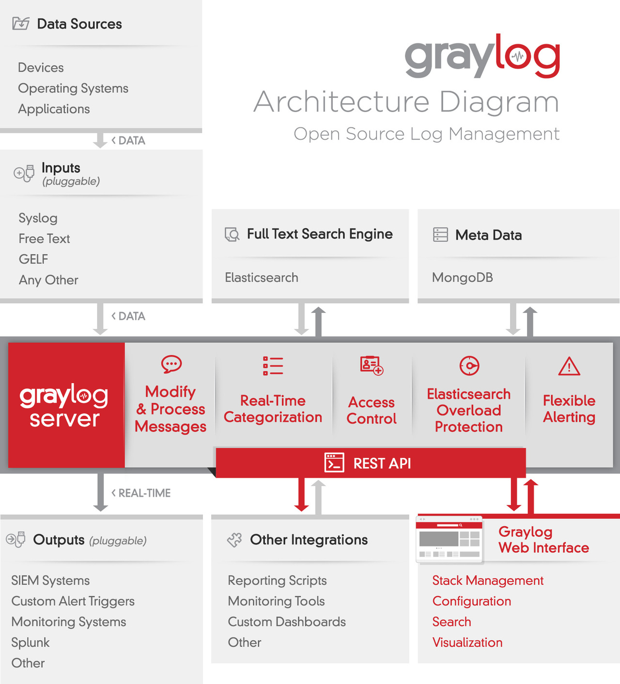

import Meta from './_include/graylog.md';

<Meta name="meta" />

## 入门指南{#guide}

### 初始化{#wizard}

1. Websoft9 控制台安装 Graylog 后，通过 "我的应用" 查看应用详情  


   - 在 **访问** 标签页中获取 **访问URL** 和 **登陆用户和密码**
   - 在 **容器** 标签页中获取 **主容器名称** 

2. 查看 **主容器** 的日志，获取用户和初始密码

3. 浏览器输入 **访问URL**，输入步骤2获取的用户和初始密码进入初始页面

4. 点击 **Create CA**，根据提示完成初始化

5. 初始化完成后，进入登陆页面，输入步骤1获取的  **登陆用户和密码**

6. 成功登陆 Graylog 后台界面
  

## 企业版

Websoft9 是 Graylog 企业版的合作伙伴，Graylog 企业版的定价因素包括：  

* 日志存储量：Graylog 企业版主要以日志存储量作为定价的参考指标
* 集群：Graylog 集群部署也是定价的参考指标之一
* ES：Elasticsearch 开源版支持集群，如果需要考虑更多功能， 需 订阅 Elasticsearch 商业版。

## 配置选项{#configs}

- SMTP（✅）：配置文件的 **transport_email** 参数实现
- 配置文件：配置选项都可以加上大写的前缀 GRAYLOG_ 实现容器的环境变量化
    ```
    GRAYLOG_TRANSPORT_EMAIL_ENABLED: "true"
    GRAYLOG_TRANSPORT_EMAIL_HOSTNAME: smtp
    GRAYLOG_TRANSPORT_EMAIL_PORT: 25
    GRAYLOG_TRANSPORT_EMAIL_USE_AUTH: "false"
    GRAYLOG_TRANSPORT_EMAIL_USE_TLS: "false"
    GRAYLOG_TRANSPORT_EMAIL_USE_SSL: "false"
    ```
- [Graylog API](https://docs.graylog.org/v1/docs/rest-api)

## 管理维护{#administrator}

- 集群： Graylog 支持复杂的[集群](https://docs.graylog.org/v1/docs/multinode-setup)部署
  

## 故障

#### 登录后告警和错误提示 ？

**现象 1**：提示 There is a node without any running inputs. This means ... ？

**原因**：这只是一个当前没有 input 的提醒，并非错误。  
**方案**：新建一个本地的 input，即可消除此提醒

**现象 2**：提示 Index rotation strategy null not found... ?  
**原因**：磁盘可用空间低于 15% 的时候，会出现这个问题  
**方案**：释放冗余的文件或者增加服务器磁盘空间

#### Graylog 存储数据吗？

它不存储，它依赖于 Elasticsearch 存储数据。  

Elasticsearch 架构中：  

* Elasticsearch 用于存储日志和搜索日志，集群可以提升效率
* Graylog 用于传输数据和展现数据，集群可以提升可用性
* MongoDB 用于存储配置信息，数据很少，集群作用有限

#### Graylog 的架构原理？ 

请阅读官方的[架构指南](https://www.slideshare.net/Graylog/graylog-engineering-design-your-architecture)


