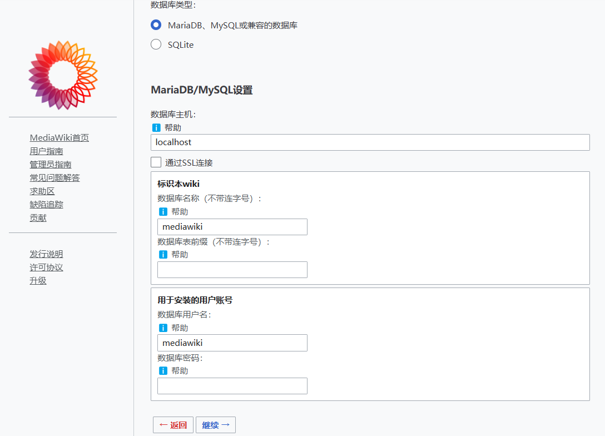

import Meta from './_include/mediawiki.md';

<Meta name="meta" />

## 入门指南{#guide}

### 初始化

1. Websoft9 控制台安装 MediaWiki 后，通过 "我的应用" 查看应用详情

  - 在 **访问** 标签页中获取访问 URL 
  - 在 **数据库** 标签页中获取 **内网主机** 和 **密码** 

2. 本地浏览器访问 URL，进入 Mediawiki 初始化向导

3. 默认提供的数据库配置如下：

   

      - 数据库类型：`MySQL`
      - 数据库主机：步骤 1 获取的  **内网主机**
      - 数据库名称：`mediawiki`
      - 数据库用户名：`mediawiki`
      - 数据库密码：步骤 1 获取的  **密码** 

   > 信息填写完毕后选择立即安装wiki即可

4. MediaWiki 安装完成后，下载安装程序生成的 LocalSettings.php 文件

5. 返回 Websoft9 控制台，通过 "我的应用" 查看应用详情，在 **编排** 标签页中点击 **马上修改** ，进入 */src* 目录下，点击 **添加文件**，选择 **上传文件** ，将 LocalSettings.php 文件上传，点击 **提交变更** 

6. 回到 */src* 目录的上一级目录，进入 docker-compose.yml 文件，取消如下代码注释，之后点击 **提交变更** 
   ```
   # - ./src/LocalSettings.php:/var/www/html/LocalSettings.php
   ```

7. 返回 "我的应用"，在 **编排** 标签页中点击 **重建应用** 或者点击右上角 **重建应用** 图标重建应用

8. 再次通过本地浏览器访问 URL 即可登录

### 快速设置

Websoft9 控制台安装 Mediawiki 后，通过 "我的应用" 查看应用详情，在 "访问" 标签页中获取登录信息。  

- 安装扩展：[Manual:Extensions](https://www.mediawiki.org/wiki/Manual:Extensions/zh)
- 可视化编辑器：[Help:Starting_a_new_page](https://www.mediawiki.org/wiki/Help:VisualEditor/User_guide/zh)
- 文件上传：[Help:FAQ:启用文件上传](https://www.mediawiki.org/wiki/Manual:FAQ/zh#如何启用文件上传?)
- 语言设置：[Help:FAQ:语言设置](https://www.mediawiki.org/wiki/Manual:FAQ/zh#我如何更改界面语言？)
- 界面定制：[Help:FAQ:定制界面](https://www.mediawiki.org/wiki/Manual:FAQ/zh#定制界面)，修改 Logo, 设置导航栏，修改 CSS 等 

### 设置 SMTP{#smtp}

1. 编辑*/bitnami/mediawiki*目录下的 `LocalSettings.php` 配置文件

2. 找到变量 $wgSMTP，并设置它
   
   ```
    $wgSMTP = array(
    'host'     => "smtp.163.com", 
    'IDHost'   => "example.com",      // 邮箱域名，可选.如果不设置的话会设置成 $wgServer 的值.
    'port'     => 465,                 
    'auth'     => true,               
    'username' => "websoft9@163.com",     
    'password' => "#wwBJ8"       
    );
   ```

3. 找到变量 $wgEnableEmail，设置其值为 true
   
   ```
    $wgEnableEmail = true
   ```


4. 查找以下变量，将其值设置为发件邮箱
   
   ```
    $wgEmergencyContact = "websoft9@163.com";
    $wgPasswordSender = "websoft9@163.com";
   ```

5. 设置完成后，重启应用后生效


## 配置选项{#configs}

- 配置文件（已挂载）：*/bitnami/mediawiki/LocalSettings.php*
- [API:Main_page](https://www.mediawiki.org/wiki/API:Main_page/zh)
- 多语言（✅）
- 多媒体文件（✅）

## 管理维护{#administrator}


## 故障
