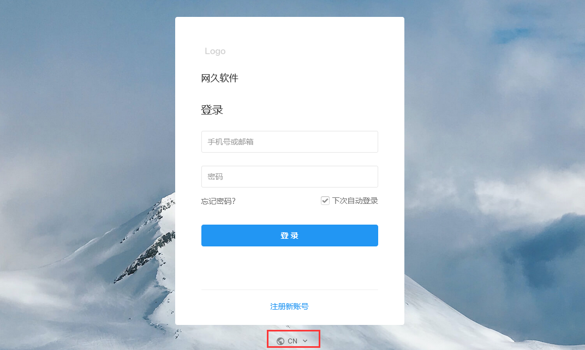
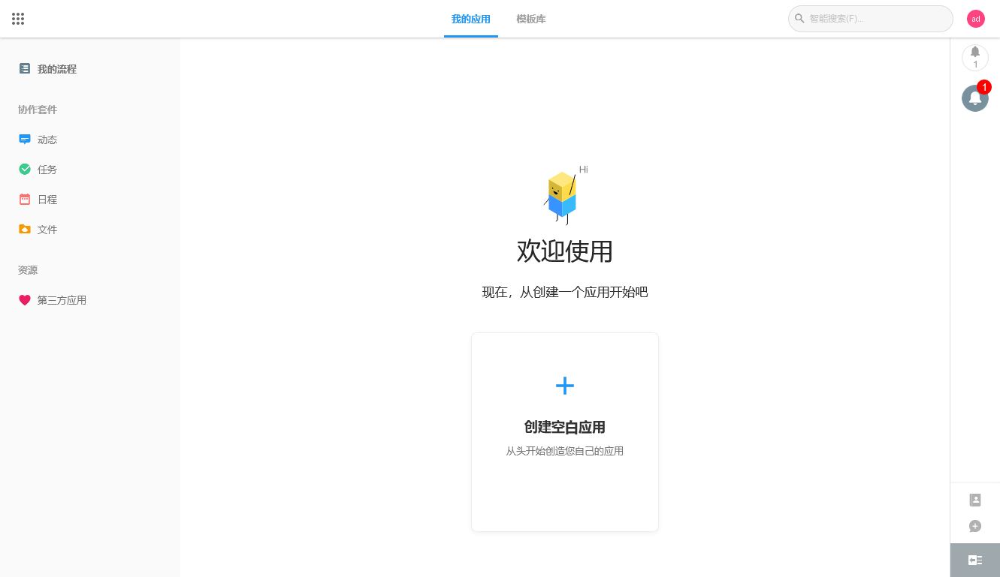

import Meta from './_include/mingdao.md';

<Meta name="meta" />

## 入门指南{#guide}

### 初始化{#wizard}

Websoft9 控制台安装 MingDao（明道云） 后，通过 "我的应用" 查看应用详情，在 "访问" 标签页中获取**初始化地址**  

1. 浏览器打开**初始化地址**，进入设置**访问地址**界面（与初始化地址不同）
   
   - 可更改默认端口为其他值
   - 建议设置域名访问

2. 开始正式的 3-5 分钟初始化过程：导入数据库、明道云官网申请秘钥、注册系统管理员账号等

2. 本地浏览器打开第1步设置的**访问地址**，登录明道云后台

5. 访问第1步设置的访问地址（例如：`http://服务器公网IP:8880`），登陆明道云后台
    
    
   

## 企业版与定制

### 托管与交付

Websoft9 是明道云的技术托管合作伙伴，我们可以为明道云的客户和合作伙伴提供：

- 公有云或私有云的部署、托管服务
- 明道云升级支持
- 明道云高可用性支持 

### 定制服务

Websoft9 具备基于明道云的软件快速构建能力。我们可以为客户提供如下的服务：

- 基于实际业务，快速建立基础数据模型
- 提炼管理流程，将业务融合到软件操作中
- 将明道云与其他系统的连接集成，打破企业数据孤岛

### 发行版

* [SaaS 版本](https://www.mingdao.com/price)，其中又分为：免费版、标准版、专业版、旗舰版四种
* [私有部署版](https://www.mingdao.com/pd)，其中又分为：社区版（免费）、标准版、专业版三种

## 配置选项{#configs}

- 免费版限制：用户数不超过 30 个，单个工作表最大行数 10 万行
- SMTP 设置：右上角用户图标下的**系统配置 > 邮件服务设置**
- [API](https://help.mingdao.com/API1.html)
- [系统维护命令](https://docs.pd.mingdao.com/deployment/command)
- 多语言：中文和英文

## 管理维护{#administrator}

- **更换 URL**：URL 变化后，需修改 docker-compose 配置文件，修改 **ENV_MINGDAO_HOST** 为新的 URL，重启容器后生效

## 故障

#### 服务器重启后，程序打不开？

重启明道服务
