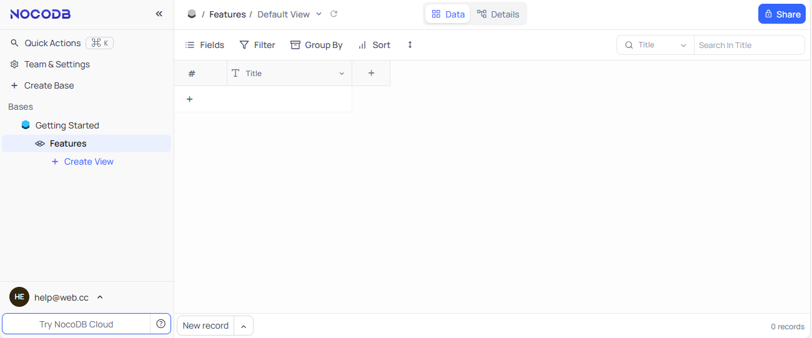

import Meta from './_include/nocodb.md';

<Meta name="meta" />

## 入门指南{#guide}

### 注册登录{#wizard}

1. Websoft9 控制台安装 NocoDB 后，通过 "我的应用" 查看应用详情，在 "访问" 标签页中获取访问 URL  

2. 访问 URL，进入首次注册页面，注册后登录后台
   

## 配置选项{#configs}

- 多语言（✅）

## 管理维护{#administrator}

## 故障