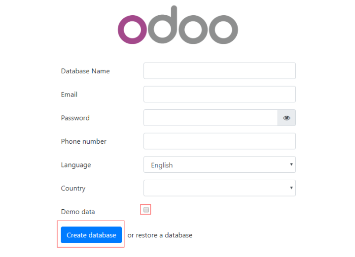
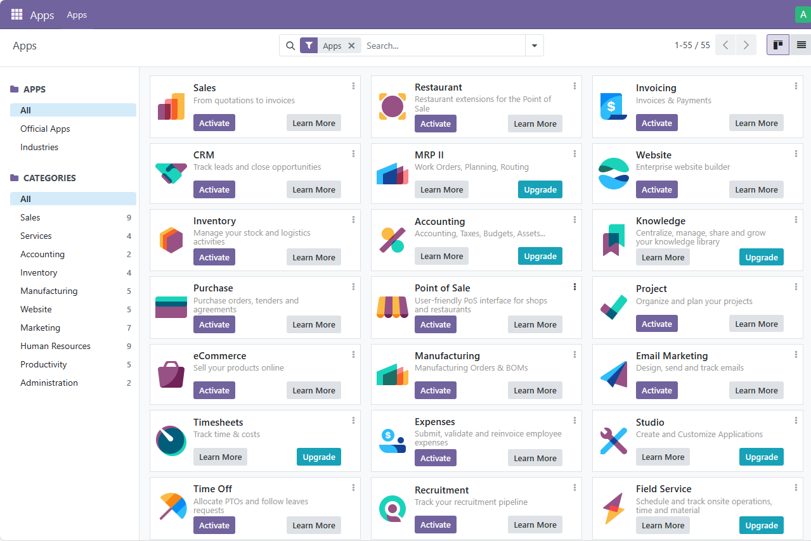

import Meta from './_include/odoo.md';

<Meta name="meta" />

## 入门指南{#guide}

### 初始化向导{#wizard}

1. Websoft9 控制台安装 Odoo 后，通过 "我的应用" 查看应用详情，在 "访问" 标签页中获取访问 URL。 

2. 使用本地浏览器访问 URL，开始初始化的第 1 步：创建数据库
   

3. 填写好所有参数（Email 和 Password 是登录账号），点击 **create database**，等待初始化完成

4. 登录到后台，默认进入 Apps 页面  
   

5. 点击左上角的设置图标，打开 **Settings** 项，可设置语言、企业信息等

### 开发者模式{#dev-mode}

开发者模式开启方式：**Settings > Developer Tools > Active the developer mode**

### 导入第三方应用

1. 登录 Odoo 控制台，激活开发者模式
2. 上传插件到 Odoo 容器的 `/mnt/extra-addons` 目录（自行决定是否挂载到宿主机）
3. 重启 Odoo 容器后，第三方应用便显示在应用列表中

### 导出 PDF

安装 Invoice、Purchase 等模块可以测试 **print to PDF** 功能

## 企业版

如果想使用企业版，请联系 [Websoft9 客户成功团队](./helpdesk#contact) 获取企业版镜像和试用授权码

- 企业版安装第一个应用后，就需要输入试用授权码
- 1 个月免费试用期结束之后，数据库会被被清空

Websoft9 提供 Odoo 企业版的采购、交付和全面托管服务：

- 高效率的商务流程
- 公有云和私有云的全面托管服务
- 企业内部管理的 Odoo 低代码开发 

## 配置选项{#configs}

- [Odoo Apps 市场](https://www.odoo.com/apps/modules)（✅）

- 自定义 Logo（✅）：**Settings > My Company**

- 多租户（多企业组织）（✅）：在 Odoo 登录界面的 "Manage Databases" 入口进入数据库管理，其中增加一个数据库，即增加一个企业，多个数据库可以共享 Odoo 运行时

- 多语言（✅）：右上角设置菜单的 **Preferences** 设置语言

- Odoo 配置文件（已挂载）： */etc/odoo/odoo_config/odoo.conf*  

- CLI：`odoo -h`

- [API](https://www.odoo.com/documentation/17.0/developer/misc/api/odoo.html)

- 社区版在线升级到企业版（✅）

- SMTP（✅）：**Settings > General Settings > Discuss > Use Custom Email Servers**

## 管理维护{#administrator}

- **数据库管理**：Odoo 自带数据库管理器，在 Odoo 登录页面的 **Manage Database** 链接中进入。它支持创建、复制、备份、恢复和删除等操作。

## 故障

#### 删除 Demo 数据？

官方没有提供便捷的 Demo 数据删除工具

#### 413 Request Entity Too Large？

需通过 Websoft9 网关中配置 `client_max_body_size 0`，解除文件限制。

#### 使用 ** 我的应用 > 数据库 ** 中 `postgres` 用户无法连接Postgresql数据库?

Odoo 不能直接使用  `postgres` 用户，你可以 **我的应用 > 概览**中的 `应用Id` 即是具有管理员权限的数据库用户名

