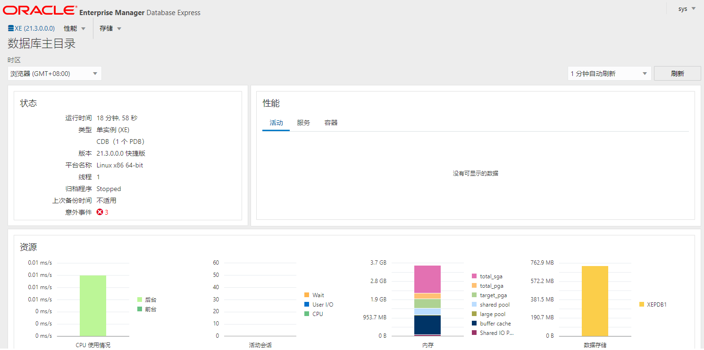
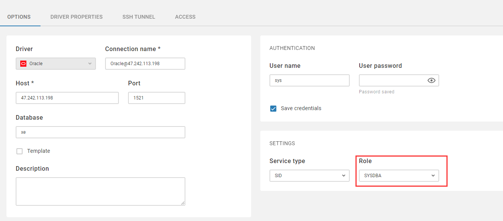
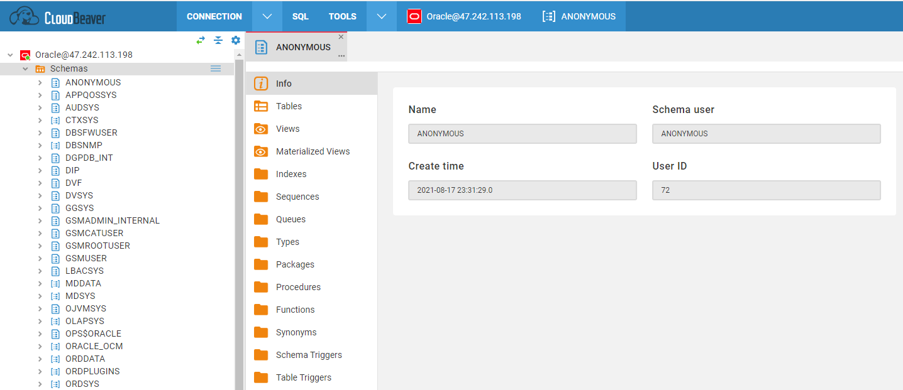

import Meta from './_include/oracle.md';

<Meta name="meta" />

## 入门指南{#guide}

### 知识产品申明

- Oracle Database XE 是免费版，而 Oracle Database 企业版或标准版是收费版，用户需向官方获取授权
- XE 安装时不限制服务器配置。但它运行时设置了资源上线：最多 11GB 存储，最多使用 1GB 内存和 1 个 CPU
- 在使用软件之前，建议阅读[ Oracle Database 快捷版 11*g* 第 2 版的 OTN 许可协议](http://www.oracle.com/technetwork/licenses/database-11g-express-license-459621.html)

### 初始化{#wizard}

#### 拉取镜像（可选）

针对于 **Oracle Database 企业版或标准版**，安装之前需拉取镜像（镜像有 10G，建议 100M 带宽）：

   - 到 Oracle [官方网站注册](https://profile.oracle.com/myprofile/account/create-account.jspx) 一个免费用户账号

   - 登录 [Oracle Database Repositories](https://container-registry.oracle.com/) 网站，阅读并同意 **Oracle Standard Terms and Restrictions**

   - 此时，您已经被允许在 Oracle 镜像仓库中拉取镜像

   - 连接到云服务器，通过授权，拉取 Oracle 数据库镜像（修改 tag）
     ```
     docker login container-registry.oracle.com/database/enterprise
     docker pull container-registry.oracle.com/database/enterprise:tag
     ```

#### 安装应用

Websoft9 控制台安装 Oracle Database 应用，然后再 "我的应用" 查看应用详情，在 "访问" 标签页中获取登录信息。  

#### Oracle EM 连接数据库

1. 本地浏览器 `https` 访问 EM 登录界面，输入默认用户名和密码后，进入 Oracle EM 控制台
   

2. 进入 Oracle 数据库容器中，运行下面的命令测试可用性
   ```
   sqlplus SYS  AS SYSDBA
   ```

### 图形化管理

我们推荐使用 [CloudBeaver](./cloudbeaver) 作为 Oracle 数据库的 Web 管理平台：

1. 新建一个 Oracle 数据库连接，关键信息说明：

   - Service Type: SID
   - Role: SYSDBA

    

2. 连接成功的界面
    


### 获取 SID 或 Servce Name{#getsid}

1. 在 Oracle 容器中运行 sqlplus 命令
    ```
    sqlplus / as sysdba 
    ```

2. 运行查询实例信息的 SQL 命令，instance_name 即所需的信息
    ```
    SQL> show parameter instance

    NAME                                 TYPE        VALUE
    ------------------------------------ ----------- ------------------------------
    active_instance_count                integer
    instance_abort_delay_time            integer     0
    instance_groups                      string
    instance_mode                        string      READ-WRITE
    instance_name                        string      XE
    instance_number                      integer     0
    instance_type                        string      RDBMS
    open_links_per_instance              integer     4
    parallel_instance_group              string
    ```

## 配置选项{#configs}

- 容器端口

  | 端口号 | 用途                                          | 必要性 |
  | ------ | --------------------------------------------- | ------ |
  | 1521   | 远程连接 Oracle Database | 可选   |
  | 5500   | HTTPS 访问 Oracle EM  | 可选   |

- Oracle Database 配置文件路径（已挂载）：*/opt/oracle/oradata/dbconfig*  

- 重置密码命令：`./setPassword.sh <your_password>`

- 客户端命令：

  - `sqlplus / as sysdba`
  - expdp 导出
  - impdp 导出
  - rman 备份与恢复

- Oracle 连接信息

  * 用户名: sys
  * Role：SYSDBA
  * Port: 1521 或 其他自定义的端口
  * [服务名称或 SID](#getsid)

- 生态工具：
  
  - SQL Developer：SQL Developer是 SQL*Plus 的图形版
  - [APEX](./apex)：用于 Oracle 数据库的 Web 应用程序开发工具。
  - [Oracle REST Data Services](https://www.oracle.com/database/technologies/appdev/rest.html)
  - Oracle GoldenGate：是一种异步、基于日志的实时数据复制产品。
  - Oracle Clusterware 是实现 Oracle Real Application Clusters (Oracle RAC) 的工具。  

## 管理维护{#administrator}

- **备份与恢复**：Oracle 备份与恢复主要通过 Recovery Manager (RMAN) 实现，命令为 `rman`


## 问题与故障

#### Error ORA-28040？

错误详情：Error "ORA-28040: No matching authentication protocol"？  
问题原因： 客户端与服务端的协议版本不一致   
解决方案： 升级客户端

####  Error ORA-28009？

错误详情：ORA-28009: connection as SYS should be as SYSDBA or SYSOPER？  
问题原因： 连接数据库时用户与默认的 role 不匹配    
解决方案： 连接信息中的 role 选择为 SYSDBA or SYSOPER

####  Error ORA-00440: Message 440...？

错误详情：创建用户时，ORA-00440: Message 440 not found;product=RDBMS;facility=ORA？     
问题原因： 登陆的 sysdba 权限的 sys 用户在 root 库上，需要连接到数据 PDB 库    

#### SID 和 Service Name 区别？

SID 是数据库实例唯一的名称。 Service Name 是向监听（TNS）注册后的别名。可以给同一个数据库实例配置多个 Service Name。  

所以，大多数情况下， SID 和 Service Name 名称是相同的。  

#### Oracle 可视化管理工具？

* EM：企业管理器，主要是监控作用
* Oracle SQL Developer：可以导入导出、编写 SQL 脚本等
* ORDS：是 Oracle Web 化的中间件，提供 API，PL/SQL 等能力，集成了 Oracle SQL Developer
* [APEX](./apex)：是基于 ORDS 的一个无代码开发平台

#### PL/SQL 是什么？

PL/SQL 是 Oracle 服务端的存储过程编程语言

#### Oracle 网络服务必须配置吗？

Oracle 网络服务在分布式异构计算环境中提供企业范围的连接解决方​​案。Oracle Net 是 Oracle Net Services 的一个组件，它支持从客户端应用程序到数据库的网络会话。  

所以，在单机环境下，它不是必须的配置。  

#### Oracle 用户信息保存在哪里？

保存在 sys 下的 user$ 表里面：

```
select * from sys.user$;
```