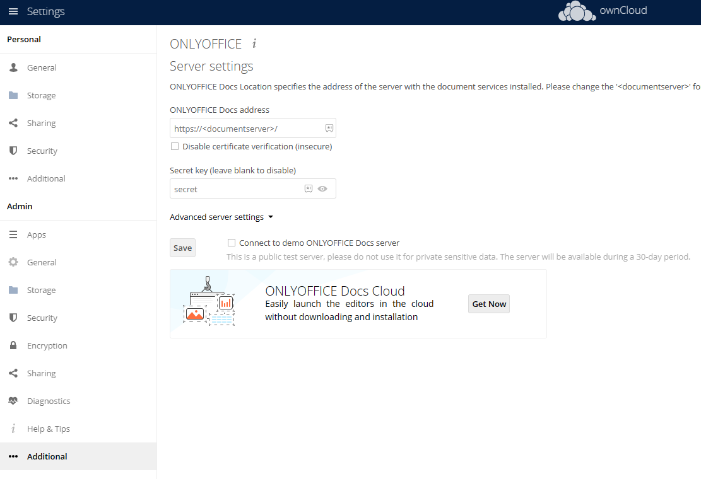

import Meta from './_include/owncloud.md';

<Meta name="meta" />

## 入门指南{#guide}

### 登录后台{#wizard}

1. Websoft9 控制台安装 OwnCloud 后，通过 "我的应用" 查看应用详情，在 "访问" 标签页中获取登录账号和 URL  

2. 访问 OwnCloud 的 URL，登录后台开始使用
   

### 文档预览与编辑 ONLYOFFICE {#onlyoffice}

1. 可选：Websoft9 控制台的 **应用商店**，安装 ONLYOFFICE

2. 在 OwnCloud 后台 Market 中安装 ONLYOFFICE

3. 安装完成后，**settings > Admin > additional** 设置 ONLYOFFICE 连接
   

### 连接外部存储{#oss}

- ownCloud 后台：**settings > admin > Storage** 中可以设置外部存储。  
- 需 S3 支持，需到 Market 中安装 **External Storage: S3** 

### 重建索引

将 ownCloud 数据目录移动或复制到其他位置后，需运行 `occ files:scan --all` 重建索引

## 配置选项{#configs}

- [Marketplace](https://marketplace.owncloud.com/) 

- SMTP（√）：**settings > admin > Email server**

- 支持第三方存储（√）

- 多语言（√）：ownCloud 后台 **Personal > General**中设置语言

- 移动端：OwnCloud Desktop Client, OwnCloud Android App, OwnCloud iOS App

- 文档编辑与预览：需集成 [ONLYOFFICE Docs](./onlyofficedocs) 等第三方中间件实现

- 配置文件（已挂载）：*/mnt/data/config/config.php*

- CLI：[ownCloudcmd](https://doc.ownCloud.com/desktop/next/advanced_usage/command_line_client.html)

- [API](https://doc.ownCloud.com/server/next/developer_manual/core/apis/provisioning-api.html)

## 管理维护{#administrator}

- **修改 URL**：修改 OWNCLOUD_DOMAIN 和 OWNCLOUD_TRUSTED_DOMAINS [环境变量](https://doc.owncloud.com/server/10.13/admin_manual/configuration/server/config_sample_php_parameters.html#define-list-of-trusted-domains-that-users-can-log-into)，更改 config.php 无效

- **在线备份**：通过 **[OwnBackup](https://en.websoft9.com/xdocs/owncloud-image-guide/#using-apps)** 应用实现在线备份

## 故障

#### untrusted domain?

问题描述：初始化提示 You are accessing the server from an untrusted domain  
解决方案：应用编排文件 .env 中的 OWNCLOUD_DOMAIN 和 OWNCLOUD_TRUSTED_DOMAINS 为真实的 URL
