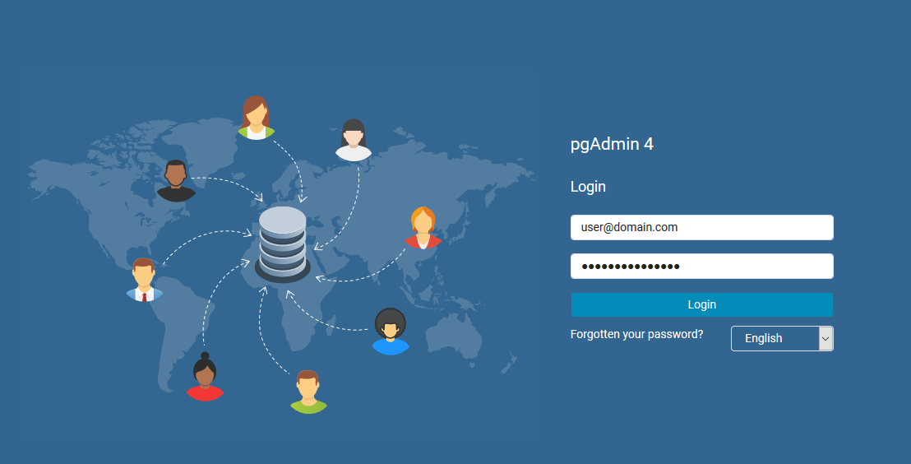
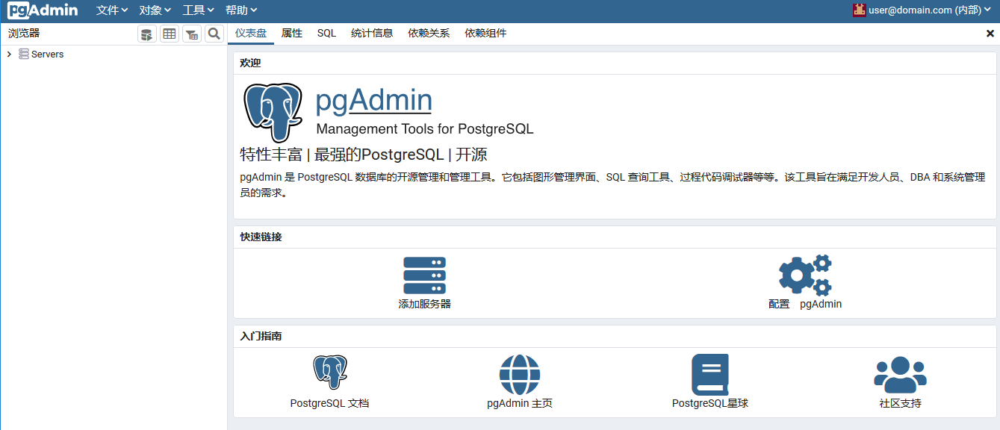
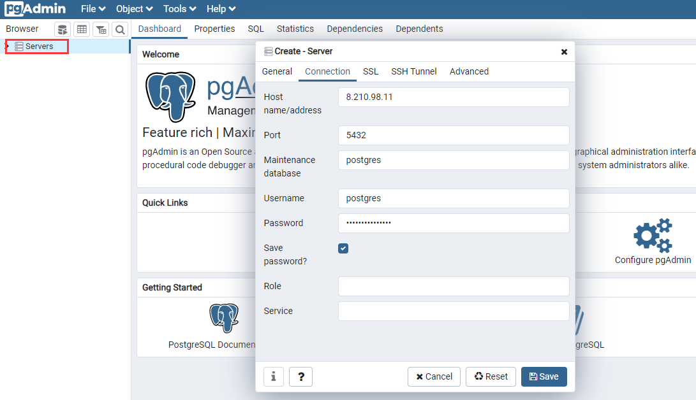

import Meta from './_include/pgadmin.md';

<Meta name="meta" />

## 入门指南{#guide}

使用 pgAdmin 之前，如果没有 PostgreSQL，可以通过 Websoft9 控制台的 **应用商店** 进行安装。

### 登录 pgAdmin 连接数据库

Websoft9 控制台安装 pgAdmin 后，通过 "我的应用" 查看应用详情，在 "访问" 标签页中获取登录信息

1. 本地电脑浏览器登录页面，进入 pgAdmin
   

2. 登录成功后，进入控制台
   

3. 连接一个 PostgreSQL 数据库
  

### 数据库管理

- **Servers > Create > Database**，创建数据库
- **Servers > Create > Login/Group Role**，创建用户（PostgreSQL 用户即 Role）

## 配置选项{#configs}

- pgAdmin 客户端：[Windows 下载](https://www.pgadmin.org/download/)
- 备份（√）

## 管理维护{#administrator}

## 故障
