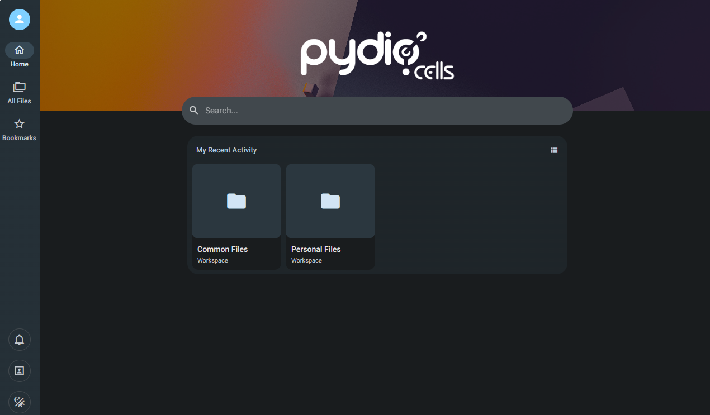

import Meta from './_include/pydio.md';

<Meta name="meta" />

## 入门指南{#guide}

### 登录后台{#wizard}

Websoft9 控制台安装 Pydio Cells 后，通过 "我的应用" 查看应用详情，在 "访问" 标签页中获取登录信息。  

1. 登录后，默认显示用户的操作界面
   

2. 右上角 **Admin > Cells Console**，切换到管理员设置界面
   

### 外部存储

通过 **Pydio 控制台 > Cells Console > Storage** 进入存储管理界面，点击 **+datasource** 增加数据源

### 文档编辑与预览{#docs}

Pydio 提供了对 [Collabora Online](./collabora) 和 [ONLYOFFICE](./onlyofficedocs)（仅限企业版）的文档中间件支持：

1. 可选：Websoft9 应用商店安装 [Collabora Online](./collabora)
2. Cells Console 控制台启用 Collabora Online 插件
2. 设置与 Collabora Online 的连接

## 配置选项{#configs}

- 插件市场（√）：**Application Parameters > All Plugins**，企业版拥有更多插件
- 兼容的外部存储：S3, Minio
- [Cells Client](https://pydio.com/en/docs/developer-guide/cells-client)
- [API Documentation](https://pydio.com/en/docs/developer-guide)
- [移动端](https://pydio.com/en/download)
- 配置文件：建议通过容器的环境变量实现个性化配置

## 管理维护{#administrator}

## 故障

#### 没有 Application Parameters？

Cells Console 左侧菜单上有一个 Application Parameters 的开关
