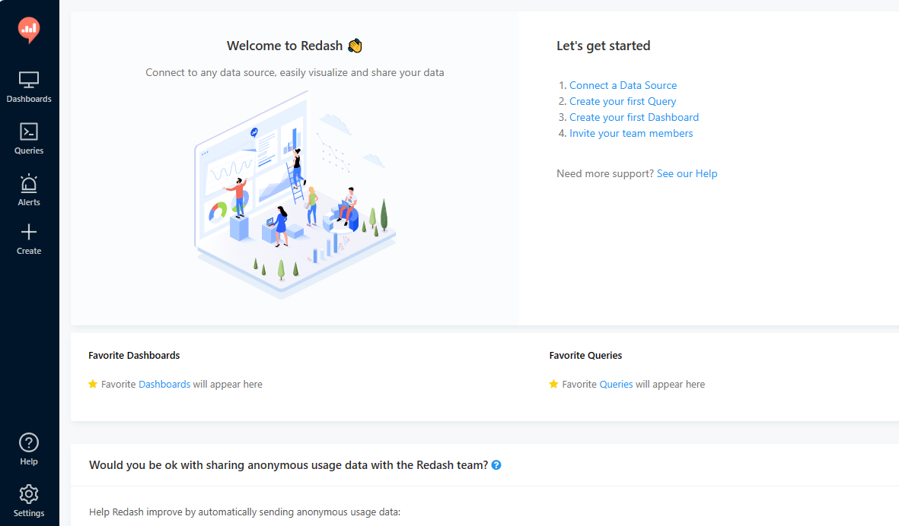

import Meta from './_include/redash.md';

<Meta name="meta" />

## 入门指南{#guide}

### 初始化{#wizard}

1. Websoft9 控制台安装 Redash 后，通过 "我的应用" 查看应用详情，在 "访问" 标签页中获取访问 URL

2. 进入初始化向导，设置用户、邮箱和密码后完成注册

3. 登录到后台开始使用
   

## 配置选项{#configs}

- 多语言（×）

## 管理维护{#administrator}

## 故障