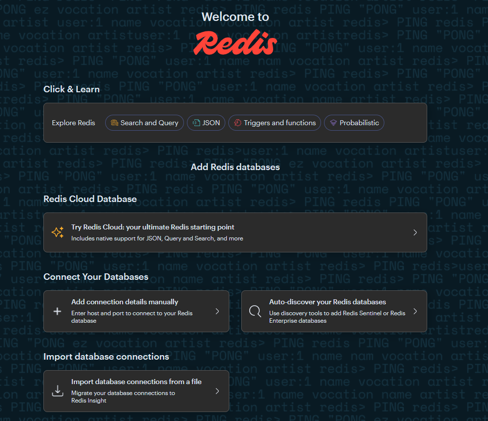

import Meta from './_include/redisinsight.md';

<Meta name="meta" />

## 入门指南{#guide}

Websoft9 控制台安装 Redash 后，通过 "我的应用" 查看应用详情，在 "访问" 标签页中获取访问 URL

### 连接 Redis 数据库{#wizard}

1. 准备 Redis 数据库（可以通过 Websoft9 应用商店安装 [Redis](./redis)）

2. 打开 RedisInsight 界面，同意使用许可后，开始使用
   

2. 点击 "Add Database Manually" 连接到 Redis 数据库

   * HOST：
     - 内网：IP/容器名/服务名
     - 外网：服务提供商处获取 URL

   * Port：6379

   * Name：redis

   * Username：空

   * Password：Redis 数据库密码

## 配置选项{#configs}

- 连接多个数据库（√）
- 控制台认证：RedisInsight 控制台无需账号验证

## 管理维护{#administrator}

## 故障