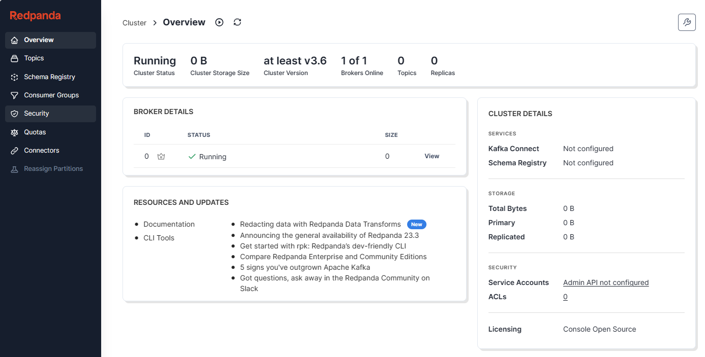

import Meta from './_include/redpandaconsole.md';

<Meta name="meta" />

## 入门指南{#guide}

### 连接 Kafka {#wizard}

Websoft9 控制台安装 Redpanda Console 时，若没有填写 Kafka brokers 或填写错误，可以通过**应用编排**的方式重新设置。

1. 连接成功，会显示如下的界面

   

2. 要增加 Schema Registry，需修改应用编排的 .env 文件

3. 要增加 Kafka brokers，在应用编排的 .env 文件 `Kafka brokers` 变量后填写主机信息（以 , 隔开）

## 配置选项{#configs}

- Kafka 连接信息：应用编排的 .env 文件中
- 配置项可以转成[环境变量](https://docs.redpanda.com/current/reference/console/config/#configuration-sources)，例如：**kafka.brokers > KAFKA_BROKERS**
- Redpanda Console [登录认证](https://docs.redpanda.com/current/reference/console/config/#redpanda-console-configuration-file)：企业版功能

## 管理维护{#administrator}

## 故障

#### Redpanda Console 容器启动时 exit?

确保 Kafka brokers 填写正确且可达

#### Security > Create user 功能失败？

错误信息：Failed to create user Redpanda Admin API is not enabled (Status 503)    
问题原因：此功能需 Redpanda 支持，而应用中没有安装 Redpanda  
解决方案：安装 Redpanda 并配置 Redpanda Console 
