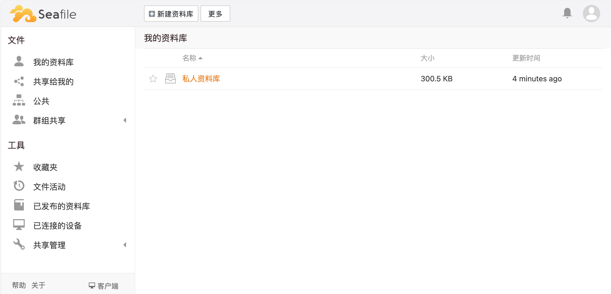

import Meta from './_include/seafile.md';

<Meta name="meta" />


## 入门指南{#guide}

### 初始化{#wizard}

Websoft9 控制台安装 Seafile 后，通过 "我的应用" 查看应用详情，在 "访问" 标签页中获取登录信息。  

1. 本地浏览器访问, 进入Seafile 登录页面

2. 输入用户名和密码，登录到Seafile后台管理界面
   

3. **系统管理 > 设置**，检查 Seafile 的 URL 是否符合，否则文件无法正常上传、下载。


### 文档编辑与预览{#docs}

1. 通过 Websoft9 应用商店安装 ONLYOFFICE Docs 或 Collabora Online

2. 向 seahub_settings.py 增加对应的连接配置，重启应用后生效
   - [ONLYOFFICE Docs](https://cloud.seafile.com/published/seafile-manual-cn/advanced_setup/only_office.md)
   - [Collabora Online](https://cloud.seafile.com/published/seafile-manual-cn/advanced_setup/libreoffice_online.md)

## 企业版

### 为什么通过 Websoft9 购买？

Websoft9 是 Seafile 的企业版合作伙伴，通过 Websoft9 采购，可以帮助用户：

- 采购收费版本，最少 10% 的折扣
- 更全面的产品支持
- 与网盘、云存储等更多技术的集成技术解决方案 

### 激活 License

将 License 文件放入 License 存放目录（已挂载），重启应用后生效 

## 配置选项{#configs}

- 配置文件（已挂载）：*/shared/seafile/conf/seahub_settings.py*
- License 存放目录（已挂载）：*/shared/seafile*
- SMTP（✅）：通过配置文件进行[设置](https://cloud.seafile.com/published/seafile-manual-cn/config/sending_email.md)，重启应用后生效
- 手机端支持（√）：与电脑端登录 URL 一致
- 多语言（√）
- 多用户（√）
- 文档分享（√）
- 文档进行预览和编辑（需第三方中间件）

## 管理维护{#administrator}

- 找回密码：编辑数据库 *EmailUser* 表的用户，password 字段更新为下面的值，密码就被重置为 `123456`
  ```
  PBKDF2SHA256$10000$7289a20ae4fc2329415b0645fa3d106019cc61952ae1bc2f9eeef7b30dc47d88$5418ac28f06bd84f2bb701a10dbea6b0bd30676c8042e1f73b9ce12aac302a8d
  ```

- SERVICE_URL：Seafile 控制台打开：**系统管理 > 设置 > URL**

- 修改邮件通知签名：Seafile 控制台打开：**系统管理 > 设置 > 品牌定制**

## 故障

#### Seafile 无法上传文件？

检查 Seafile 的 URL 是否与实际相符合
   
#### Seafile 无法编辑和预览文件？

- 确保已经正确配置 ONLYOFFICE Docs 等文档中间件
- 确保 Seafile 的 URL 是否与实际相符合

#### 文档安全令牌未正确形成？

问题描述：完成 ONLYOFFICE Docs 配置，Seafile 编辑和预览显示错误 **文档安全令牌未正确形成**   
问题原因：ONLYOFFICE docs 安全设置不符     
解决方案：需修改 ONLYOFFICE docs 编排文件中的环境变量 JWT_ENABLED，设置为 false  
