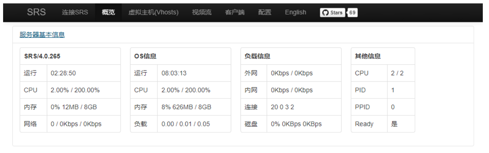
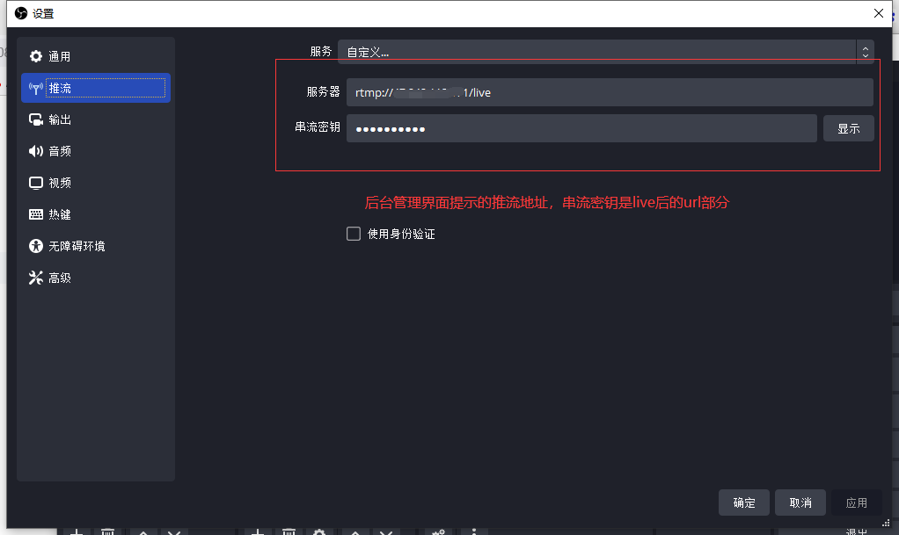

import Meta from './_include/srs.md';

<Meta name="meta" />

## 入门指南{#guide}

### 登录 SRS 控制台{#wizard}

Websoft9 控制台安装 SRS 后，通过 "我的应用" 查看应用详情，在 "访问" 标签页中获取登录信息。  

1. 本地浏览器访问后，进入后台管理页面

2. 点击 "SRS控制台" 链接，进入控制台进行监控以及各种设置
   

### 桌面推流到 SRS

以 **OBS 软件推送桌面流到 SRS** 作为一个任务，帮助用户掌握 SRS 的工作流程：

1. 本地电脑安装并启动[OBS](https://obsproject.com/download)，点击 **+** 来添加源

2. 选择**显示器采集**作为来源，保存后再开始设置

3. 推流设置
   - 服务器：srs 服务 URL
   - 串流密钥：

     

4. 输出设置

   - 编码器：选择显卡能够支持的格式

     

5. 设置完成后，分别测试推流结果

   - OBS 界面上测试推流连接
   - SRS 后台，点击**SRS播放器**查看推流结果

## 配置选项{#configs}

- 推流软件：OBS, Streamlabs

## 管理维护{#administrator}

## 故障
