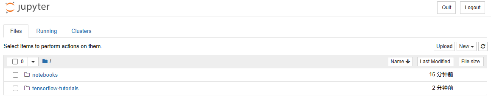
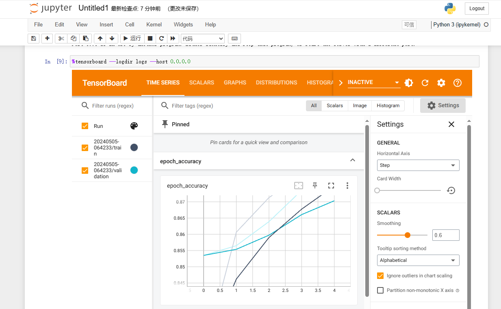

import Meta from './_include/tensorflow.md';

<Meta name="meta" />

## 入门指南{#guide}

### 登录 Jupyter{#wizard}

Websoft9 控制台安装 TensorFlow 后，通过 "我的应用" 查看应用详情，在 "访问" 标签页中获取访问信息。  

1. 本地浏览器访问 URL，进入 Jupyter 登陆页面，提示需要 Token

2. 进入 TensorFlow 容器的命令模式，运行 `jupyter notebook list`，获取 Token

3. 使用 Token 登录或设置一个密码后，登录到 Jupyter 后台
   

### 运行 TensorBoard

1. Jupyter 后台依次打开：**New > Python 3 (ipykernel)**

2. 参考 [Using TensorBoard in Notebooks](https://tensorflow.google.cn/tensorboard/tensorboard_in_notebooks)，逐一运行范例程序。最后的命令增加一个参数`--host 0.0.0.0` （允许外网访问）

4. 此时 TensorBoard 便显示在 Notebook 中
   

## 配置选项{#configs}

- 容器端口

  - 8888：Jupyter 端口
  - 6006：TensorBoard 端口

## 管理维护{#administrator}

## 故障

#### TensorBoard 在 Notebook 中不显示？

- 确保启动 TensorBoard 命令时包含 `--host 0.0.0.0` 参数
- 确保容器 6006 端口映射的宿主机端口已开启
