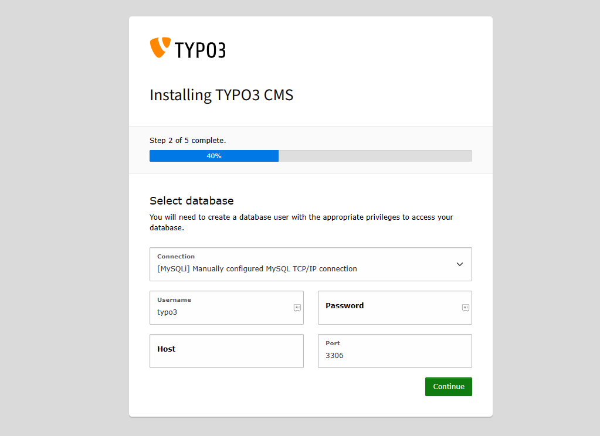
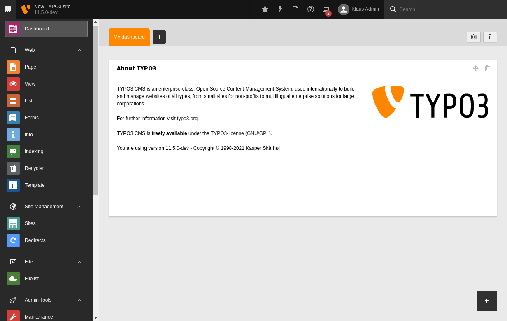

import Meta from './_include/typo3.md';

<Meta name="meta" />

## 入门指南{#guide}

### 初始化{#wizard}

1. Websoft9 控制台安装 Typo3 后，通过 "我的应用" 查看 Typo3 应用详情

   - 在 "访问" 标签页中获取访问信息
   - 在 "数据库" 标签页中获取**数据库账号** 

2. 进入 Typo3 安装向导，当环境检测步骤通过后，开始填写数据库参数

   - Username: `typo3`
   - Password: 应用管理中获取
   - Host:  应用管理中获取

     

2. 依次后续步骤：创建管理员账号、设置站点信息等

3. 登录后台，开始创作网站  
   

4. 完成安装后登录后台

### 配置选项{#configs} 

- CLI
  * typo3 -- 官方核心命令行
  * typo3cms -- 第三方扩展命令

- 多语言（√）：[Changing The Backend Language](https://docs.typo3.org/m/typo3/tutorial-getting-started/main/en-us/Setup/BackendLanguages.html#backendlanguages)

- 扩展（√）：Typo3后台 "ADMIN TOOLS" > "Extensions"
- 模板（√）：Typo3后台 "WEB" > "Template"

## 管理维护{#administrator}

- 在线升级（√）：Typo3后台 "ADMIN TOOLS" > "Upgrade"

## 故障
