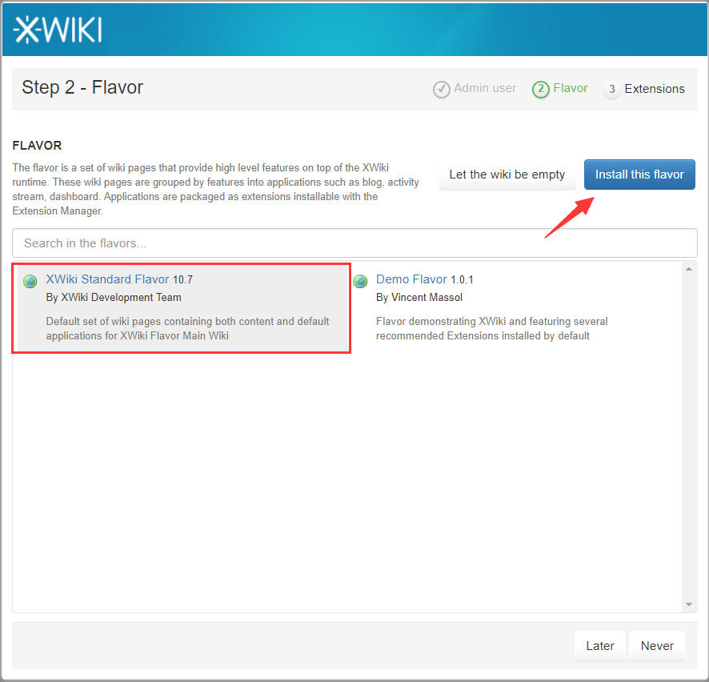

import Meta from './_include/xwiki.md';

<Meta name="meta" />

## 入门指南{#guide}

### 初始化{#wizard}

Websoft9 控制台安装 XWiki 后，通过 "我的应用" 查看应用详情，在 "访问" 标签页中获取登录信息。  

1. 进入安装向导后，Xwiki 开始初始化，耐心等待  

2. 依次完成后续步骤：设置管理账号、安装预制模板（**此步骤不能跳过,否则无法使用**）
    

3. 等待所有安装完成

## 配置选项{#configs}

## 管理维护{#administrator}

## 故障