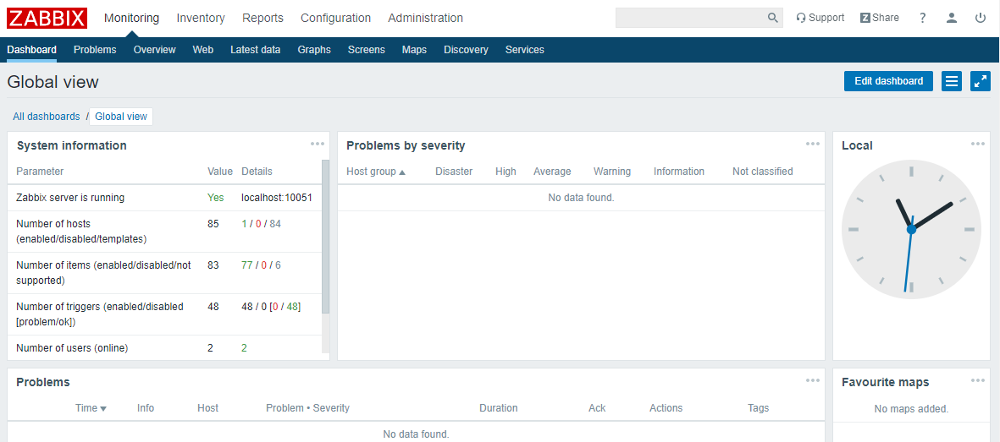

import Meta from './_include/zabbix.md';

<Meta name="meta" />

## 入门指南{#guide}

### 登录后台{#wizard}

Websoft9 控制台安装 Zabbix 后，通过 "我的应用" 查看应用详情，在 "访问" 标签页中获取登录信息。  

1. 访问应用 URL, 进入登录界面

2. 成功登录到 Zabbix 后台
   

### 增加被监控主机

1. 先到目标主机上安装 Zabbix-Agent （推荐容器安装）

2. 登录到 Zabbix 控制台后，打开：**配置 > 主机**，新增一个主机，填写目标主机的连接信息

4. 刷新主机列表页，列变中主机显示 **绿色** 即表明监控已成功

## 配置选项{#configs}

- SMTP（√）:后台 **管理 > 报警媒介类型 > Email**

- 多语言（√）：通过后台 User Profile 切换，无目标语言需先安装 [How to install locale](https://www.zabbix.com/community)

- 监控的对象：监控各种IT组件，包括网络、服务器、虚拟机和云服务

- 组件：Zabbix-Server，Zabbix-Web，Zabbix-Proxy，Zabbix-Agent，Zabbix-java-gateway

## 管理维护{#administrator}

- 重置密码：Zabbix 数据库中运行 SQL `update zabbix.users set passwd=md5(new_password) where alias='Admin`

## 故障

