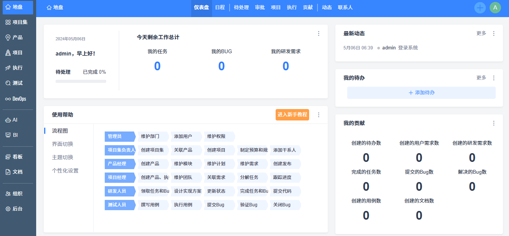

import Meta from './_include/zentao.md';

<Meta name="meta" />

## 入门指南{#guide}

### 初始化{#wizard}

1. Websoft9 控制台安装 Zentao（禅道） 后，通过 "我的应用" 查看应用详情，在 "访问" 标签页中访问地址 

2. 进入初始化界面，根据提示逐一完成后续步骤（建议保持默认的数据库连接设置）

3. 安装完成后，体验后台 
   

## 配置选项{#configs}

- 多语言（✅）：支持后台切换
- 命令行：[初始化管理脚本](https://www.zentao.net/book/zentaopmshelp/35.html)
- 插件市场（✅）：[注册](https://www.zentao.net/user-register.html)官网账号，在线安装插件
- 客户端（✅）：仅为禅道专业版和企业版用户提供
- 禅道目录（已挂载）：*/data*
- 插件路径（已挂载）：*/data/module*
- 集成 Git（✅）
- SMTP（✅）："后台" > "通知" > "邮件"，选择 STMP 作为发信方式

## 管理维护{#administrator}

- 安装插件：支持 [插件市场](https://www.zentao.net/extension-browse.html) 在线安装，也支持下载解压到插件目录中安装
- 重置密码：修改数据库 **zt_user** 表，password 字段值改成 `e10adc3949ba59abbe56e057f20f883e` ，密码即重置为：`123456`
- 在线备份："后台" > "系统设置" > "备份"

## 故障

#### 密码输入错误多次被锁？

1. 10 分钟后会自动解锁。
2. 管理员登录，组织 → 用户 操作栏里有解锁按钮。