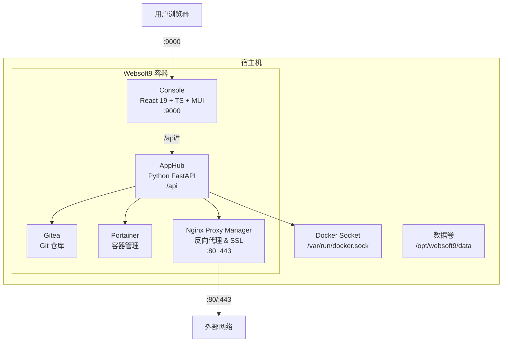

# 架构

Websoft9 是一个以应用为中心的微服务架构模式，它入门极简，扩展能力极强。  

## 架构哲学

**"一切皆应用，一切可组装"** 是 Websoft9 的根本哲学思想，基于这个哲学思想，我们灵活的将优秀的开源软件融合到产品体系中。  

我们的架构中遵循一些主要的技术思想：

- 通过组装实现产品创新
- [云原生 12 要素](https://12factor.net/zh_cn/)
- 开源迭代，持续演化
- 专注于连接，减少非必要的原创组件
- 使用已经流行的技术要素，避免再创造新的技术规范
- GitOps 云原生持续交付模型
- Unix 哲学 KISS 原则： Keep It Simple, Stupid!

## 架构图

Websoft9 采用**单容器集成控制平面**架构，所有核心服务运行在一个 Docker 容器内。

### 核心组件

- **Console**：基于 React 19 + TypeScript + Vite + MUI 构建的 Web 管理界面，通过 `9000` 端口提供服务
- **AppHub**：基于 Python FastAPI 的业务逻辑 API，负责应用管理、认证、代理、备份等核心功能
- **Gitea**：内嵌的 Git 仓库服务，用于托管应用模板和代码
- **Portainer**：内嵌的容器管理服务，负责 Docker 容器和栈的生命周期管理
- **Nginx Proxy Manager**：反向代理服务，处理域名绑定、SSL 证书管理（Let's Encrypt），绑定 `80` 和 `443` 端口

## 开放兼容

Websoft9 采用 [Docker Compose](https://docs.docker.com/compose/) 作为应用程序的模板，同时开源由 Websoft9 维护的[模板库](https://github.com/Websoft9/docker-library)。  

也就是说，应用实际上最终运行在 Docker Compose 编排下，即使不使用 Websoft9 的控制台管理应用，也不会被任何技术体系绑架，做到绝对的收放自如、自主可控。  
