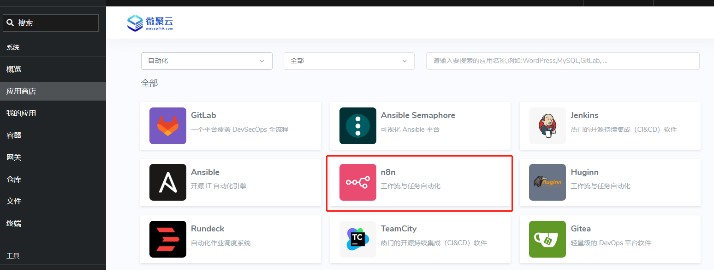

import DocCardList from '@theme/DocCardList';
import {useCurrentSidebarCategory} from '@docusaurus/theme-common';

# 自动化任务的实现与管理

本章节将探讨的自动化任务概念，它不仅仅局限于传统服务器计划任务（如 Crontab）所能提供的功能。

在这里，我们定义的自动化任务涉及到周期性的、基于特定规则的活动，这些活动可以通过编写脚本、使用专业的工具来执行。   

自动化不仅能够提升工作效率、降低出错率，还能释放人力资源，让他们将注意力转向更需要创造性和复杂性的任务上。   

在 Websoft9 托管平台上，推荐使用 [n8n](./n8n) 来构建自动化的工作流程。n8n 提供了一种基于图形界面的流程设计方法，可以轻松创建和管理多种自动化任务，包括但不限于：

1. **服务器维护任务**：比如自动化的数据备份、日志清理、时间同步和安全扫描等。
2. **DevOps 工作流**：包括代码审查、源代码编译、自动化测试等自动化流程。
3. **应用集成**：实现不同应用系统之间的自动化数据和流程集成。

## 启动自动化工具

1. 通过 Websoft9 应用商店安装 [n8n](./n8n) 应用 

   

2. 安装完成后，进入到 n8n 管理界面，开始设计和执行自动化任务，优化您的工作流程。

## 场景指南

下面是基于 [n8n](./n8n) 的具体使用场景指南：

<DocCardList items={useCurrentSidebarCategory().items}/>

## 问题

#### n8n 可实现 Crontab 的功能吗？

可以，并远超 Crontab

#### n8n 支持跨服务器吗？

支持，通过 ssh 连接到任何服务器上执行自动化
