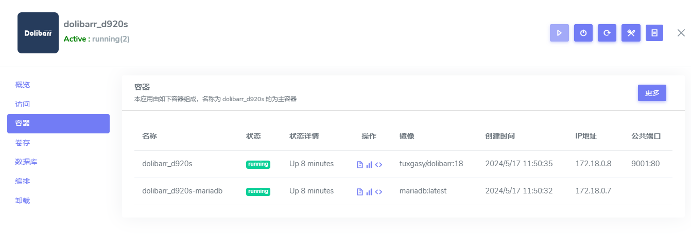
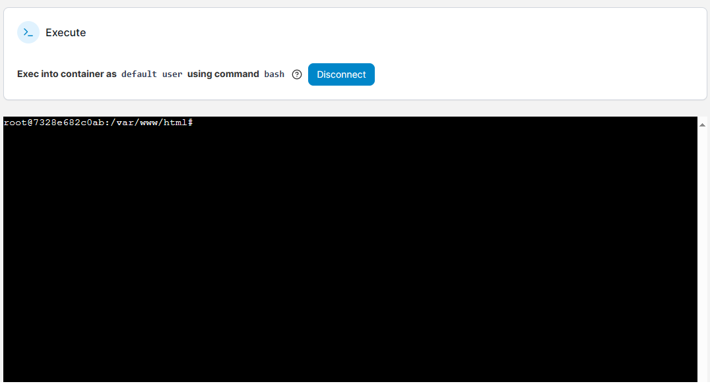

# 在容器内运行命令

用户需要掌握在容器内运行命令的操作，便于更好的实现个性化的托管设置。  

## 原理

在容器内运行命令之前，先列出几个相关的原理：

- 容器内运行命令与 Linux 虚拟机内运行命令的原理基本一致
- 容器内运行命令改变的是容器的文件系统
- 容器内也可以切换用户
- 容器内改变文件系统后，也需要考虑权限问题
- 容器内安装或下载的软件包，若没有存放到持久化目录中，重建容器后这些增加的文件会丢失

## 进入容器{#docker-exec}

进入容器后，默认便可以运行 shell 命令。有两种进入容器的方法：

### 登录服务器运行命令{#fromserver}

Docker 自身提供了进入了容器的操作指令 [docker exec](https://docs.docker.com/reference/cli/docker/container/exec/) ，具体步骤：

- 确认容器的 shell 命令环境： bash, sh, ash 三者之一，大部分都是 bash
- 服务器端运行 `docker ps` 找到容器名称，然后运行命令 `docker exec -it container_name bash`

### 在线运行命令{#fromweb}

Websoft9 提供了可视化的在线运行容器命令的功能，它是 **docker exec** 的 Web 实现。

1. Websoft9 控制台进入应用的详情页面，在 "容器" 标签页下点击 `<>` 操作
    

2. 在容器命令行控制台，点击 **Connetc** 按钮，开始连接

    - Command：选择可用的命令执行（三选一，bash 绝大部分情况下都可用）
    - user: 默认 root（推荐）

3. 成功连接，即可开始运行命令
   

## 安装软件包

容器内安装软件与 Linux 安装软件基本一致：

- 操作系统包管理器：apt, yum, dnf, pacman, zypper, apk 等
- 手工下载编译安装
- 程序语言安装包：pip, npm, yarn, gem 等

## 查看容器内配置

- 进程与服务：`top`, `ps aux`
- 用户：`cat /etc/passwd`
- 网络：`netstat -tulnp`, `ss -tuln`

## 权限处理

- 如果 Dockerfile 没有创建普通用户，容器就会默认以 root 用户权限运行。   
- 容器 root 与宿主机 root 是同一个用户，但容器 root 需加上 `--privileged=true` 才拥有宿主机同等权限
- 容器内可以通过 `su` 切换用户