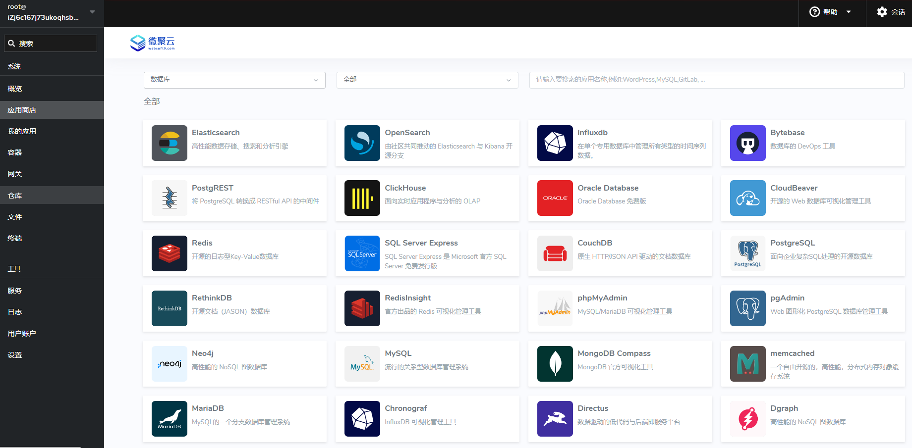

# 部署数据库服务

Websoft9 平台为您提供了市场上主流数据库系统的广泛选择。内置的部署模板包括了多个版本的 MySQL, MariaDB, PostgreSQL, MongoDB, Redis, SQL Server, Elasticsearch, Oracle Database, Neo4j 等数据库，允许用户一键部署自己的数据库服务。    

## 开始部署

用户通过 Websoft9 应用商店的 **数据库** 类目，即可快速部署数据库服务：

1. 登录 Websoft9 控制台，进入 **应用商店** 下的 **数据库**，列出所支持的数据库
   

2. 根据需要可以通过二级分类进一步查询

3. 选择目标数据库，开始 [部署数据库应用](./deployment#appstore)

## 配置参考

在 Websoft9 应用商店中启动的数据库服务，遵循一套默认配置标准，以确保安全性和易用性。   

以下是这些数据库服务默认配置的关键属性及其说明：

- **运行模式**：数据库实例采用容器化技术运行，保证了环境的一致性和可移植性。
- **数据持久化**：通过命名卷（Named Volume）实现数据持久化，确保数据的持久存储和独立管理。
- **外部连接**：数据库默认已映射到宿主机端口，仅需在安全组中开放相应端口，即可实现外网访问。
- **配置管理**：数据库配置可通过容器环境变量或挂载的配置文件进行调整和管理。

若需进一步自定义数据库配置，可参照数据库应用启动后对应的[Git仓库](./plan-git#manage)进行操作。

## 默认账号对照表{#table}

基于 Websoft9 部署的数据库，其默认系统账号、端口与管理工具对应表，供您参考：

| 数据库          | 管理员   | 端口  | Web 版管理工具          |
| --------------- | -------- | ----- | ----------------------- |
| MySQL           | root     | 3306  | phpMyadmin, CloudBeaver |
| MariaDB         | root     | 3306  | phpMyadmin, CloudBeaver |
| PostgreSQL      | postgres | 5432  | pgAdmin, CloudBeaver    |
| SQL Server      | sa       | 1433  | CloudBeaver             |
| MongoDB         | root     | 27017 | MongoDB Compass           |
| Oracle Database | system   | 1521  | CloudBeaver             |
| Redis           | 空       | 6379  | RedisInsight            |

## 相关操作

- [部署数据库管理工具](./dbtools)
- [连接并管理数据库](./connectdb)

